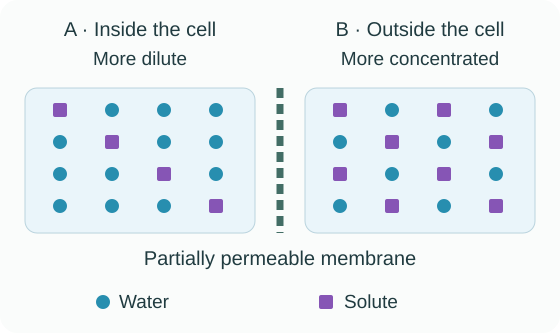
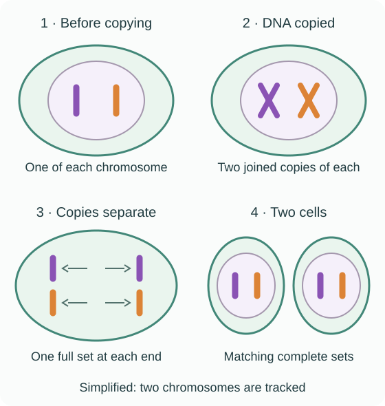

# Cell biology questions & answers

## 1 mark

**1.** Give the main function of the nucleus in an animal cell.

**Answer:** It **controls the cell's activities**. It contains the genetic information that provides instructions for the cell.

**2.** What process takes place in chloroplasts?

**Answer:** Photosynthesis. Chloroplasts contain chlorophyll, which absorbs light.

**3.** Name the tissue at the growing tips of roots and shoots that contains stem cells.

**Answer:** Meristem tissue.

**4.** Name the process in which an unspecialised cell becomes a cell with a particular job.

**Answer:** Differentiation.

**5.** DNA replication happens before mitosis. Give one other change that happens in the cell before it divides.

**Answer:**

- The cell grows.
- Alternatively: it **increases the number of mitochondria or ribosomes**. Give one of these changes.

**6.** Describe what diffusion means.

**Answer:** The **net movement of particles from a higher concentration to a lower concentration**.

**7.** Give one difference between active transport and osmosis, referring to energy.

**Answer:** **Active transport requires energy from respiration; osmosis does not require an energy supply**.

**8.** Before weighing a potato piece after an osmosis investigation, a student gently blots its surface dry. Explain why.

**Answer:** Surface solution would **add to the measured mass**, so blotting makes the measurement reflect the potato's mass.

**9.** In an antibiotic investigation, one paper disc contains sterile water and no antibiotic. What is the purpose of this disc?

**Answer:** It is a control, showing whether a clear zone is caused by the antibiotic rather than the paper disc or water.

**10.** How could a student check whether the results of an antiseptic investigation are repeatable?

**Answer:** **Repeat the investigation using the same method and compare the results to see whether they are similar**.

## 2 marks

**11.** A yeast cell is eukaryotic. A bacterial cell is prokaryotic. Give two structures found in yeast cells but not bacterial cells.

**Answer:**

- A nucleus, enclosing the genetic material.
- Mitochondria, where aerobic respiration takes place.

Avoid: both cells have a cell membrane, cytoplasm and ribosomes. These are not differences.

**12.** Give two advantages of an electron microscope over a light microscope when studying sub-cellular structures.

**Answer:**

- Higher magnification: structures can appear larger.
- Higher resolution: nearby structures can be seen as separate, revealing finer detail.

Remember: magnification makes the picture bigger; resolution makes the detail clearer.

**13.** A light microscope has a ×10 eyepiece lens and a ×40 objective lens. Calculate the total magnification.

**Answer:**

- Total magnification = **eyepiece magnification × objective magnification** = 10 × 40.
- Total magnification = ×400. Magnification has no length unit.

**14.** Compare what embryonic stem cells and adult bone-marrow stem cells can become.

**Answer:**

- **Embryonic stem cells can differentiate into most types of human cell**.
- **Bone-marrow stem cells form a more limited range of cells**, including different blood cells.

**15.** A drug stops fibres attaching to the copied chromosomes during mitosis. Explain why normal cell division cannot be completed.

**Answer:**

- The fibres cannot **pull the chromosome copies to opposite ends of the cell**.
- The nucleus cannot divide normally to give **two nuclei with complete, identical sets of chromosomes**.

**16.** A small single-celled organism exchanges enough oxygen through its outer surface. A large multicellular animal cannot do this. Explain why.

**Answer:**

- The larger animal has a **smaller surface area to volume ratio**, so its outer surface supplies less oxygen relative to its needs.
- Many cells are far from the surface. **Diffusion distances are too long** for diffusion alone to supply oxygen quickly enough.

**17.** A potato cylinder has an initial mass of 3.00 g and a final mass of 2.64 g. Calculate its percentage change in mass.

**Answer:**

- Percentage change = **(final mass − initial mass) ÷ initial mass × 100** = (2.64 − 3.00) ÷ 3.00 × 100.
- Percentage change = −12%. The negative sign shows a loss of mass.

Avoid: dividing by the final mass. Use the starting mass as the denominator.

**18.** A student investigates how sugar concentration affects potato mass. Name the independent variable and a suitable dependent variable.

**Answer:**

- Independent variable: concentration of the sugar solution.
- Dependent variable: percentage change in the mass of the potato pieces.

## 3 marks

**19.** State the function of each structure: cell membrane, mitochondria and ribosomes.

**Answer:**

- Cell membrane: controls the movement of substances into and out of the cell.
- Mitochondria: the site of aerobic respiration, which releases energy.
- Ribosomes: the site of protein synthesis.

Avoid: saying mitochondria “create energy”. Respiration releases energy.

**20.** Explain how three features of a sperm cell help it reach and fertilise an egg cell.

**Answer:**

- Its tail moves the sperm towards the egg.
- It has many mitochondria, which release energy through respiration for movement.
- Its head contains enzymes that help it penetrate the egg's outer layers.

Remember: name the feature and link it to its job, like explaining why a tool is useful.

**21.** The measured length of a cell's image is 36 mm. The cell's real length is 60 µm. Calculate the magnification.

**Answer:**

- Convert to matching units: **60 µm = 0.060 mm**.
- Magnification = **image size ÷ real size** = 36 ÷ 0.060.
- Magnification = ×600.

Avoid: dividing a value in millimetres by a value in micrometres without converting.

**22.** The diagram represents the boundary between a potato cell and the surrounding solution. The membrane lets water pass but prevents the solute shown from crossing.

Explain why the potato loses mass in this solution.

**Answer:**

- There is a **net movement of water out of the potato cells by osmosis**.
- Water moves from the **more dilute solution inside the cells to the more concentrated solution outside**.
- Water crosses the **partially permeable cell membrane**. Losing water reduces the potato's mass.

Avoid: saying salt moves out by osmosis. Osmosis is the movement of water.

**23.** The concentration of mineral ions is 0.5 arbitrary units in the soil solution and 2.0 arbitrary units inside a root hair cell. Explain how the cell can absorb more of these ions.

**Answer:**

- The ions enter by active transport.
- They move from a **lower concentration in the soil to a higher concentration in the cell**, against the concentration gradient.
- This requires **energy released by respiration**.

**24.** Explain how each change increases the rate of diffusion: a higher temperature, a steeper concentration gradient and a larger membrane surface area.

**Answer:**

- Higher temperature: particles have more kinetic energy and move faster.
- **Steeper concentration gradient:** the concentration difference is greater, so there is faster net movement from high to low concentration.
- **Larger surface area:** more particles can cross the membrane at the same time.

**25.** Explain why a student uses a thin layer of onion epidermis, adds iodine solution, and lowers the cover slip at an angle.

**Answer:**

- A **thin layer lets light pass through** and helps individual cells be seen clearly.
- Iodine solution **stains cell structures**, making them easier to distinguish.
- Lowering the cover slip at an angle **reduces trapped air bubbles**, which could obscure the cells.

**26.** Explain why a school bacterial culture is incubated at no more than 25°C, has its lid held with a few pieces of tape, and is stored upside down.

**Answer:**

- **No more than 25°C reduces the risk of growing bacteria harmful to humans**, many of which grow well at body temperature.
- Tape **keeps the lid in place**, reducing contamination and accidental opening. Do not seal all the way around, because this encourages anaerobic conditions.
- Storing the dish upside down **prevents condensation dripping onto the agar** and spreading colonies.

**27.** The total circular zone of inhibition around a paper disc has a diameter of 18 mm. Calculate its area, including the disc. Use π = 3.14 and give your answer to 3 significant figures.

**Answer:**

- Radius = **diameter ÷ 2** = 18 ÷ 2 = 9 mm.
- Area = πr² = 3.14 × 9² = 254.34 mm².
- Area to 3 significant figures = 254 mm².

Avoid: using the diameter as the radius. If a question asks for the clear area excluding the disc, subtract the disc's area.

**28.** A culture starts with 80 bacteria. The population doubles every 20 minutes. Assume nutrients and temperature remain suitable. Calculate the population after 2 hours, giving your answer in standard form.

**Answer:**

- Number of doublings = **120 ÷ 20 = 6**.
- Population = **80 × 2⁶ = 5120 bacteria**.
- In standard form: **5.12 × 10³ bacteria**.

Avoid: multiplying 80 by 6. Each division doubles the whole population.

**29.** A grower wants many plants with the same disease resistance as a parent plant. Explain why meristem stem cells are useful.

**Answer:**

- Meristem stem cells can **divide and differentiate into any type of plant cell**, allowing whole plants to develop.
- They produce **genetically identical clones**, preserving the parent's disease-resistance genes.
- **Large numbers can be produced quickly and economically**.

## 4 marks

**30.** The diagram tracks two chromosomes in a simplified cell. Each colour represents a different chromosome. Explain how the cell cycle produces two genetically identical daughter cells.

**Answer:**

- Before mitosis, the cell grows and increases its sub-cellular structures. **DNA replicates to form two identical copies of each chromosome**.
- During mitosis, the copies **separate, with one complete set pulled to each end of the cell**. The nucleus divides.
- The **cytoplasm and cell membrane divide**, producing two cells.
- Each daughter cell receives the **same complete set of genetic information**, so the daughter cells are genetically identical.

Remember: copy the whole instruction book, then give each new cell a complete copy. DNA is copied before mitosis; each daughter cell keeps the original chromosome number.

**31.** Explain how alveoli are adapted for rapid gas exchange. Link each feature to its effect.

**Answer:**

- Many alveoli provide a **large surface area**, so more gas can diffuse at once.
- Alveolar walls and capillary walls are **one cell thick**, creating a **short diffusion distance**.
- A **good blood supply** carries oxygen away and brings carbon dioxide, maintaining concentration gradients.
- Ventilation replaces the air, keeping oxygen concentration high and carbon dioxide concentration low in the alveoli.

**32.** Explain how fish gills absorb enough oxygen from water. Refer to surface area, thickness, blood supply and water flow.

**Answer:**

- Many gill filaments with folds provide a **large surface area** for diffusion.
- The exchange surface and capillary walls are thin, creating a **short diffusion distance**.
- A **good blood supply** carries absorbed oxygen away, maintaining a concentration gradient.
- **Water flowing over the gills** brings fresh oxygen, maintaining a concentration gradient between the water and blood.

**33.** Two cubes have side lengths of 1 cm and 3 cm. Calculate the surface area to volume ratio of each cube. Then explain which cube has the greater surface area relative to its volume.

**Answer:**

- **1 cm cube:** surface area = 6 × 1² = 6 cm²; volume = 1³ = 1 cm³.
- Its surface area to volume ratio is 6:1.
- **3 cm cube:** surface area = 6 × 3² = 54 cm²; volume = 3³ = 27 cm³; ratio = 2:1.
- The **smaller cube has the larger surface area to volume ratio**: it has three times as much surface area per unit volume.

Avoid: saying the smaller cube has a larger total surface area. Its total surface area is smaller; its ratio is larger.

## 5 marks

**34.** A student obtains these results after leaving potato pieces in sugar solutions for 40 minutes.

| Sugar concentration (mol/dm³) | Mean percentage change in mass (%) |
|---|---|
| 0.00 | +12 |
| 0.10 | +8 |
| 0.20 | +4 |
| 0.40 | −4 |
| 0.50 | −8 |
| 0.60 | −12 |

Plot a graph with labelled axes, suitable scales and a line of best fit. Use it to estimate the concentration at which there is no net movement of water.

**Answer:**

- Put **sugar concentration (mol/dm³)** on the x-axis and **mean percentage change in mass (%)** on the y-axis. Use even scales that fill most of the grid.
- Plot the three positive values correctly: **(0.00, 12), (0.10, 8), (0.20, 4)**.
- Plot the three negative values correctly: **(0.40, −4), (0.50, −8), (0.60, −12)**.
- Draw a **straight line of best fit** for these data. Do not force a straight line if another data set has a curved trend.
- Read where the line crosses **0% change in mass: 0.30 mol/dm³**. Water still moves both ways, but there is **no net movement**.

**35.** An onion cell image is 5.4 cm long at a magnification of ×600. Calculate the cell's real length in micrometres. State the equation and show each step.

**Answer:**

- **Magnification = image size ÷ real size**.
- Rearrange: **real size = image size ÷ magnification**.
- Substitute: real size = **5.4 ÷ 600**.
- Real size = 0.009 cm.
- Convert: 1 cm = 10 000 µm, so 0.009 × 10 000 = 90 µm.

**36.** Explain how the small intestine is adapted to absorb digested food efficiently, including absorption by active transport.

**Answer:**

- **Villi and microvilli increase surface area**, allowing more absorption at once.
- The villi have a **thin surface layer**, giving a short diffusion distance.
- A **good blood supply carries absorbed substances away**, maintaining a concentration gradient.
- The intestine is long, providing time and a large overall area for absorption.
- Absorbing cells have many mitochondria, releasing energy through respiration for active transport when substances must move against a concentration gradient.

## 6 marks

**37.** A tiny cylindrical structure has a real volume of 6 280 000 nm³ and a real radius of 100 nm. Its image is 2.4 mm long. Calculate the magnification. Use π = 3.14.

The length of a cylinder is given by: **length = volume ÷ (π × radius²)**.

**Answer:**

- Substitute: real length = **6 280 000 ÷ (3.14 × 100²)**.
- Real length = 200 nm.
- Use **magnification = image size ÷ real size**.
- Convert the image length: **2.4 mm = 2 400 000 nm**.
- Substitute: magnification = **2 400 000 ÷ 200**.
- Magnification = ×12 000.

Avoid: rounding intermediate values too early, or adding mm/nm to a magnification answer.

**38.** Scientists propose using embryonic stem cells to replace damaged nerve cells in a person with paralysis. Evaluate this proposal, including benefits, medical risks and ethical concerns.

**Answer:**

- **Embryonic stem cells can divide and differentiate into nerve cells**, so they could replace damaged cells and help restore function.
- They can become **most types of human cell**, giving them more potential uses than adult bone-marrow stem cells.
- There is a risk of **transferring viral infection**. Uncontrolled cell division could also form a tumour.
- Cells from an unrelated embryo could be **rejected by the patient's immune system**. In therapeutic cloning, the embryo has **the same genes as the patient**, so its stem cells are not rejected.
- Obtaining the cells may destroy an embryo. Some people object because they see this as **destroying potential human life**. Others consider the potential benefit to patients more important.
- Judgement: the treatment could be valuable if testing shows it is safe and effective. Its possible benefits must be weighed against medical risks and ethical concerns; adult stem cells may avoid embryo destruction but have more limited uses.

**For a strong answer:** connect each benefit or risk to this treatment, and finish with a reasoned judgement.

**39.** Describe how to prepare an onion-cell slide, obtain a clear image using a light microscope, and record what you observe.

**Answer:**

- Peel a **thin layer of onion epidermis** and place it flat in a drop of water on a slide.
- Add iodine solution to make cell structures clearer. Lower a cover slip gently at an angle to avoid air bubbles.
- Put the slide on the stage and begin with the lowest-power objective. Adjust the light so the specimen is illuminated.
- Use the coarse focus carefully to find the image, then fine focus to make it sharp. Keep the lens clear of the slide.
- Centre the cells, switch to a higher-power objective if needed, and refocus using fine focus.
- Draw a large, accurate outline with clear, unshaded lines. **Label visible structures** such as the cell wall, cytoplasm and nucleus. Include the **magnification or a scale**. Wear eye protection when using the stain and cut away from fingers when preparing the onion.

Avoid: drawing chloroplasts in onion bulb epidermis. These cells do not normally contain them.

**40.** Plan an investigation into how salt concentration affects the percentage change in mass of potato pieces. Include measurements, control variables and how to process the results.

**Answer:**

- Prepare a **range of salt concentrations**, including distilled water, in labelled containers. For example, use 0.0, 0.2, 0.4, 0.6 and 0.8 mol/dm³.
- Cut equal-sized, skin-free potato cylinders from the same potato. Use a cork borer and cut to equal lengths on a tile, keeping fingers clear of the blade.
- Blot each piece consistently and measure its initial mass on a balance. Put pieces into each solution so they are fully submerged.
- Keep **temperature, time in solution, solution volume and potato dimensions** the same. For example, leave all pieces for 40 minutes at the same temperature.
- Remove the pieces, **blot off surface solution** in the same way, and measure the final mass. Calculate **(final − initial) ÷ initial × 100** for each piece.
- Use **at least three pieces per concentration**, check any unusual result and calculate a mean percentage change. Plot mean percentage change against concentration. Read the 0% crossing to estimate the solution concentration inside the potato cells.

**For a strong answer:** give the steps in order and explain how the controls make the comparison fair.

**41.** A student tests three salt concentrations using one potato cube in each. The cubes come from the same potato and have equal dimensions. The student records initial mass, leaves each cube “for a while”, then weighs it wet. Different solution volumes are used. The student compares the changes in grams.

Evaluate the method and suggest improvements, explaining why they are needed.

**Answer:**

- Strength: using the same potato and equal dimensions reduces variation in cell contents and surface area. Measuring initial and final mass allows change to be calculated.
- Use a **fixed, equal time** for every cube. Different times allow different amounts of water movement and make the comparison unfair.
- Use the **same solution volume**, fully submerge each cube and keep temperature constant. This controls other factors that could affect water movement.
- **Blot every cube consistently before weighing**. Otherwise, surface solution adds extra mass.
- **Repeat each concentration and calculate a mean**. This reduces the effect of random variation and helps identify unusual results. Use more concentrations, especially near the zero-change point, to estimate it more precisely.
- Compare **percentage change in mass**, rather than grams alone, because this accounts for different initial masses. Judgement: the method has useful controls, but uncontrolled time, surface liquid and lack of repeats make its present results insufficient for a confident conclusion.

**42.** Describe a school investigation to compare the effects of two antiseptics on bacterial growth. Include aseptic technique, a control, fair-test conditions and measurements.

**Answer:**

- Use **sterile nutrient agar and a sterile Petri dish**. Disinfect the bench. Sterilise the inoculating loop in a flame and let it cool before spreading a safe bacterial culture evenly over the agar.
- Use sterile forceps to place equal-sized paper discs containing the antiseptics onto the agar, well apart. **Open the lid as little as possible** to reduce contamination.
- Include a disc with the **same volume of sterile water but no antiseptic** as a control.
- Keep the **bacterial species, initial bacterial amount, disc size, volume of liquid, incubation time and temperature** the same. Use equal antiseptic concentrations if comparing the substances themselves.
- Secure the lid with a few pieces of tape, **without sealing all the way around**. Incubate the dish upside down at **no more than 25°C**. Keep it closed when examining the results.
- Measure the **diameters of the zones of inhibition** through the closed dish. Calculate areas using πr². Repeat each treatment and compare mean areas: a larger zone means more bacterial growth was prevented **under these test conditions**.

## Past-paper sources

### Where to find papers

| Resource | What to use |
|---|---|
| [AQA assessment resources](https://www.aqa.org.uk/subjects/biology/gcse/biology-8461/assessment-resources) | Official question papers, mark schemes and examiner reports. Choose Biology 8461, Paper 1 and Higher. |
| [Physics & Maths Tutor](https://www.physicsandmathstutor.com/past-papers/gcse-biology/aqa-paper-1/) | Paper 1 question papers and mark schemes arranged by year and tier; includes older papers. |
| [Save My Exams](https://www.savemyexams.com/gcse/biology/aqa/past-papers/paper-1/) | A year-by-year directory of Higher Paper 1 papers and mark schemes. |
| [Revision Science](https://revisionscience.com/gcse-revision/biology/biology-gcse-past-papers/aqa-gcse-biology-past-papers) | Download links for AQA Biology papers and mark schemes, including recent series. |

### Papers used

These **practice questions** adapt recurring question types, with **suggested marking points**. The links below open the AQA papers and mark schemes used to check the answers. Questions also cover essential material in the [current Cell biology specification](https://www.aqa.org.uk/subjects/biology/gcse/biology-8461/specification/subject-content/cell-biology).

| June series | Question paper | Mark scheme |
|---|---|---|
| 2018 | [Paper](../../00%20-%20Past%20papers/Paper%201%20Higher/AQA-84611H-QP-JUN18.pdf) | [Mark scheme](../../00%20-%20Past%20papers/Paper%201%20Higher/AQA-84611H-MS-JUN18.pdf) |
| 2019 | [Paper](../../00%20-%20Past%20papers/Paper%201%20Higher/AQA-84611H-QP-JUN19.pdf) | [Mark scheme](../../00%20-%20Past%20papers/Paper%201%20Higher/AQA-84611H-MS-JUN19.pdf) |
| 2022 | [Paper](../../00%20-%20Past%20papers/Paper%201%20Higher/AQA-84611H-QP-JUN22.pdf) | [Mark scheme](../../00%20-%20Past%20papers/Paper%201%20Higher/AQA-84611H-MS-JUN22.pdf) |
| 2023 | [Paper](../../00%20-%20Past%20papers/Paper%201%20Higher/AQA-84611H-QP-JUN23.pdf) | [Mark scheme](../../00%20-%20Past%20papers/Paper%201%20Higher/AQA-84611H-MS-JUN23.pdf) |
| 2024 | [Paper](../../00%20-%20Past%20papers/Paper%201%20Higher/AQA-84611H-QP-JUN24.pdf) | [Mark scheme](../../00%20-%20Past%20papers/Paper%201%20Higher/AQA-84611H-MS-JUN24.pdf) |
| 2025 | [Paper](../../00%20-%20Past%20papers/Paper%201%20Higher/AQA-84611H-QP-JUN25.pdf) | [Mark scheme](../../00%20-%20Past%20papers/Paper%201%20Higher/AQA-84611H-MS-JUN25.pdf) |

### Recurring question types

This comparison counts the presence of each type across the six papers above, once per paper. Types overlap.

| Question type | Papers containing the type | Examples: June year and question |
|---|---|---|
| Cell structures and comparisons | 6 of 6 | 2019 Q01; 2023 Q05.2; 2025 Q08.1–08.2 |
| Osmosis in different contexts | 6 of 6 | 2018 Q04; 2019 Q06.4; 2023 Q03.9; 2024 Q05 |
| Stem cells and differentiation | 6 of 6 | 2018 Q06.7–06.8; 2022 Q04.5; 2023 Q01.2; 2025 Q07.1–07.2 |
| Microscopy and magnification | 4 of 6 | 2019 Q01.5–01.6; 2022 Q03; 2024 Q08.3; 2025 Q05.2 |
| Exchange surfaces and their adaptations | 4 of 6 | 2019 Q06.5; 2022 Q06.5; 2024 Q02.4; 2025 Q06.2 |
| Osmosis practical methods or data | 4 of 6 | 2018 Q04.1–04.4; 2022 Q01.4–01.9; 2024 Q05; 2025 Q03.1 |
| Bacterial culture investigations or data | 4 of 6 | 2018 Q01.6–01.9; 2023 Q03.3–03.7; 2024 Q06.2; 2025 Q08.3–08.4 |
| Mitosis and the cell cycle | 3 of 6 | 2022 Q04.4; 2023 Q05.5–05.6; 2024 Q08.1–08.4 |

### Question references

References identify the source question type; the practice wording, numbers and mark allocations may differ.

| Practice questions | Past-paper question types used |
|---|---|
| Q01–Q02, Q19 | June 2019 Q01.1; June 2022 Q01.1–01.2; June 2018 Q06.2 |
| Q03–Q04 | June 2023 Q01.2; June 2024 Q04.1; June 2022 Q04.5 |
| Q05, Q15, Q30 | June 2024 Q08.1, Q08.4; June 2022 Q04.4; June 2023 Q05.6 |
| Q06–Q07, Q23 | June 2025 Q06.1, Q03.3; June 2018 Q04.5; June 2024 Q04.5 |
| Q08–Q10 | June 2022 Q01.5; June 2023 Q03.5; June 2018 Q01.8 |
| Q11–Q12 | June 2025 Q08.2; June 2023 Q05.2; June 2019 Q01.6; June 2022 Q03.5 |
| Q14, Q38 | June 2018 Q06.7–06.8; June 2019 Q07.5–07.6; June 2025 Q07.1–07.2; stem-cell content in the specification |
| Q16, Q33 | June 2022 Q06.1–06.3; surface area to volume calculations in the specification |
| Q17–Q18 | June 2018 Q04.2; June 2022 Q01.4, Q01.6 |
| Q21, Q35, Q37 | June 2019 Q01.5; June 2022 Q03.3; June 2025 Q05.2; June 2024 Q08.3 |
| Q22 | June 2022 Q01.9; June 2024 Q05.2 |
| Q25–Q26 | June 2022 Q03.2; June 2023 Q03.3–03.4; culture safety in the specification |
| Q27–Q28 | June 2018 Q01.7; June 2023 Q03.7; June 2022 Q02.3; area and bacterial population calculations in the specification |
| Q31–Q32, Q36 | June 2022 Q06.5; June 2024 Q02.4; June 2025 Q06.2; June 2019 Q06.5 |
| Q34, Q40–Q41 | June 2022 Q01.7–01.8; June 2018 Q04.4; June 2024 Q05.1; June 2025 Q03.1 |
| Q39, Q42 | June 2022 Q03.1–03.4; June 2023 Q03.3–03.7; required practical methods in the specification |
| Q13, Q20, Q24, Q29 | Additional practice for microscopy, cell specialisation, diffusion factors and plant stem cells in the current specification |
