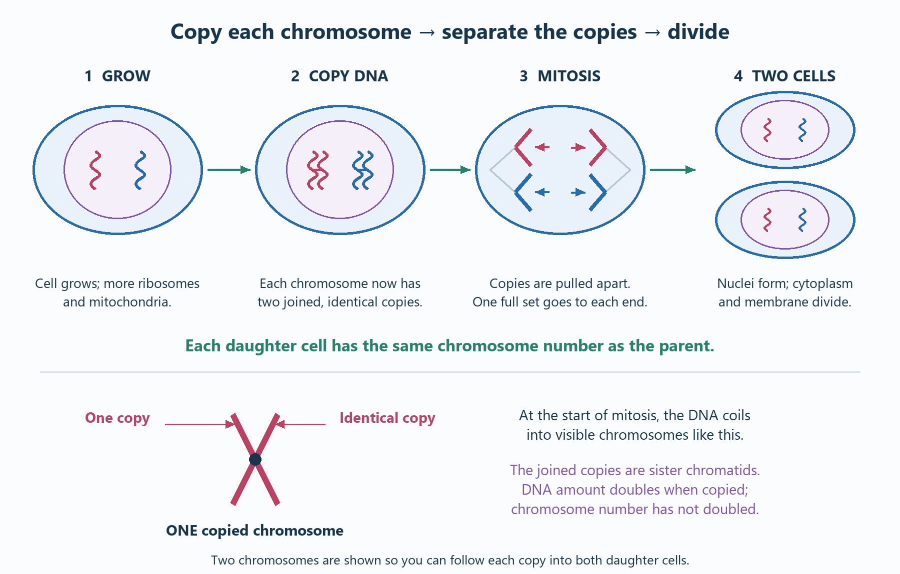
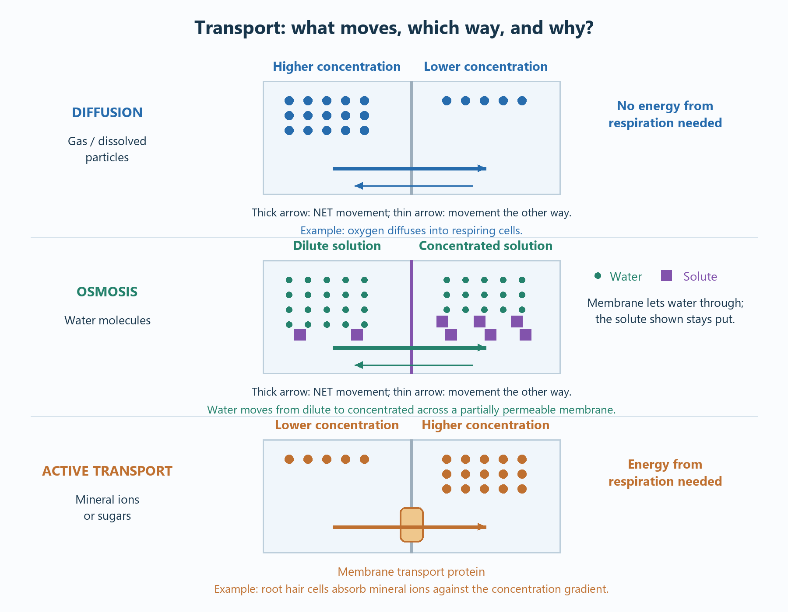
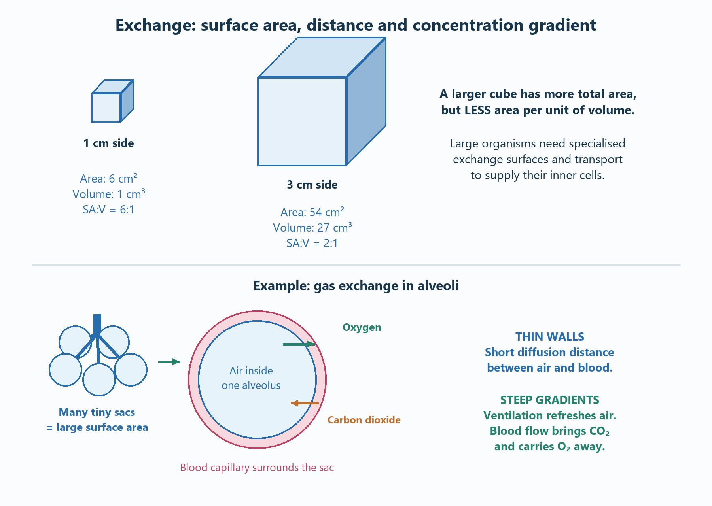

# Cell biology

## The must-know overview

- **Cell structures have functions.** Link each feature to what it helps the cell do.
- **Differentiation** makes cells specialised. **Mitosis** produces two genetically identical daughter cells.
- **Diffusion:** net movement from high to low concentration.
- **Osmosis:** net movement of water through a partially permeable membrane, from a dilute solution to a more concentrated solution.
- **Active transport:** movement against a concentration gradient, using energy from respiration.
- Know the three required practicals: **microscopy**, **bacterial growth** and **osmosis**.
- Practise **magnification**, **unit conversions**, **bacterial doubling**, **circle area**, **percentage mass change** and **surface area to volume ratio**.

## 1. Cell types and structures

A cell is a tiny working unit of a living organism. Its smaller parts each do a job.

**Analogy:** a cell is like a factory: instructions guide the work, workers make products, and a boundary controls deliveries. This is a memory aid; cells do not think or make decisions.

| Structure | Must-know function | Factory memory aid |
| --- | --- | --- |
| **Nucleus** | Contains genetic material; controls cell activities through its genes. | Instruction office |
| **Cytoplasm** | Where many chemical reactions occur; enzymes control these reactions. | Working space |
| **Cell membrane** | Controls movement of substances into and out of the cell. | Controlled entrance |
| **Mitochondria** | Site of aerobic respiration, which transfers energy for cell processes. | Energy supply |
| **Ribosomes** | Site of protein synthesis. | Protein-making machines |
| **Cell wall** | In plant cells, made of cellulose; strengthens and supports the cell. | Supporting outer structure |
| **Chloroplasts** | Site of photosynthesis; chlorophyll absorbs light. | Solar-powered production |
| **Permanent vacuole** | Contains cell sap; helps keep a plant cell firm when filled with water. | Water-filled support |

### Animal, plant and bacterial cells

- **Animal cells:** usually nucleus, cytoplasm, membrane, mitochondria and ribosomes.
- **Plant cells:** these structures plus a cellulose wall and usually a permanent vacuole; photosynthetic cells have chloroplasts.
- **Root hair cells do not normally have chloroplasts:** they are underground and do not photosynthesise.
- Plant and animal cells are **eukaryotic**: their genetic material is enclosed in a nucleus.
- Bacterial cells are **prokaryotic**: smaller, with **no nucleus**. Their main DNA is a **single loop** in the cytoplasm. Some also contain **plasmids**, small rings of DNA carrying additional genes.
- Bacteria have cytoplasm, ribosomes, a membrane and a wall. Their wall is **not cellulose**, and they have no mitochondria or chloroplasts.

**Comparing cells:** when comparing cells, state both sides: “The plant cell has a cellulose wall, whereas the animal cell has no cell wall.”

**Common mistake:** a cell wall supports the cell; the **membrane** controls exchange. They are different structures.

## 2. Specialisation and differentiation

**Differentiation** is the process in which a cell develops structures suited to a particular job. A **specialised cell** is the result.

**Analogy:** a trainee learns a job and gains the equipment needed for it. The process is differentiation; the trained worker is specialised.

| Cell | Feature → why it helps |
| --- | --- |
| **Sperm** | Tail → movement towards the egg; many mitochondria → energy for movement; acrosome enzymes → help penetrate the egg's outer layers. |
| **Nerve cell** | Long fibre → carries electrical impulses over long distances; branched ends → connections with other cells. |
| **Muscle cell** | Contractile proteins → shortening; many mitochondria → energy for contraction. |
| **Root hair cell** | Long extension → large surface area for water and mineral uptake; mitochondria → energy for active transport of mineral ions. |
| **Xylem** | Dead, hollow cells joined into tubes → water/mineral transport; lignin-strengthened walls → support and resistance to collapse. |
| **Phloem** | Sieve tubes → movement of dissolved sugars; companion cells → supply energy needed for loading sugars. |

- Most animal cells differentiate **early in development**. In mature animals, division mainly repairs or replaces cells.
- Many plant cells can differentiate **throughout life**, especially cells produced in **meristems**.
- Apply the chain **feature → effect → function** to an unfamiliar cell described in a question.

**Common mistake:** “many mitochondria” is incomplete. Explain that respiration supplies energy for the named process.

## 3. Microscopy and size calculations

### Magnification versus resolution

- **Magnification:** how many times larger the image is than the actual object.
- **Resolution:** ability to distinguish two nearby points as separate.
- An **electron microscope** has greater magnification and resolving power than a light microscope, revealing finer cell structures.

**Analogy:** enlarging a blurry photograph makes it bigger; improving its detail makes it clearer. Magnification and resolution are not the same.

### Must-know maths

**Magnification = image size ÷ actual size**

**Actual size = image size ÷ magnification**

**Image size = actual size × magnification**

Use **the same units** for image and actual size. Magnification has **no unit**.

| Conversion | Relationship |
| --- | --- |
| cm → mm | × 10 |
| mm → µm | × 1,000 |
| µm → nm | × 1,000 |
| 1 µm in metres | 1 × 10⁻⁶ m |
| 1 nm in metres | 1 × 10⁻⁹ m |

**Worked example:** image width = 30 mm; actual width = 60 µm.

1. Convert: 30 mm = **30,000 µm**.
2. Magnification = 30,000 ÷ 60 = **×500**.

**Scale example:** a 20 µm cell is 10 times wider than a 2 µm bacterium: **one order of magnitude**. Convert units before comparing. Typical sizes are estimates, not universal values.

**Estimating area:** if shapes are similar, doubling a linear dimension makes area about four times larger. State the shape assumption.

### Required practical 1: observe, draw and label cells

1. Place a thin plant sample, such as onion epidermis, on a slide with a drop of water. Use a suitable stain, such as iodine, to improve contrast.
2. Lower a coverslip gently at an angle to reduce trapped air.
3. Begin with the **lowest-power objective**. Focus with coarse, then fine adjustment.
4. Centre the cells. Increase magnification and use fine focus.
5. Observe a suitable prepared animal-cell slide, or a teacher-approved preparation.
6. Draw clear outlines with a pencil. Label only structures you can identify; avoid shading.
7. Include a **magnification scale or scale bar**. Total microscope magnification = eyepiece × objective; drawing magnification depends on the size of your drawing.

**Why a thin sample?** Light must pass through it; overlapping layers make structures difficult to identify.

**Safety:** handle glass carefully; avoid contact with stains and biological material. Follow the school procedure.

## 4. Culturing bacteria

Bacteria reproduce by **binary fission**: one bacterial cell divides into two. They can divide about every 20 minutes under suitable conditions; use the division time given in the question.

**Analogy:** repeated doubling is like photocopying every copy again: 1 → 2 → 4 → 8. Growth is exponential, not addition by a fixed number.

- **Nutrient broth** supplies substances for growth.
- **Agar plates** provide a surface on which colonies grow.
- A **colony** is a visible group of microorganisms grown from an initial cell or group of cells.
- **Aseptic technique** prevents contamination by unwanted microorganisms.

### Aseptic technique: action → reason

- Sterilise equipment and culture medium → remove unwanted microorganisms.
- Sterilise an inoculating loop, then allow it to cool → avoid contamination without killing the culture being transferred.
- Open the lid briefly → reduce entry of airborne microorganisms.
- Secure the lid with small pieces of tape, **not a complete seal** → reduce accidental opening while allowing gas exchange.
- Incubate **upside down** → condensation does not drip onto the culture.
- School cultures must be incubated at a **maximum of 25°C** → reduce the risk of growing harmful human pathogens.

These are school practical principles. Cultures should be handled and disposed of under the teacher's procedure; do not open incubated plates.

### Required practical 2: antimicrobial substances

1. Prepare a bacterial lawn on sterile agar using aseptic technique.
2. Place paper discs containing the substances being tested onto the agar. Include a **control disc** with the solvent only.
3. Keep bacterial strain, agar, disc size, substance volume, incubation time and temperature consistent.
4. After incubation, measure the **zone of inhibition**: the clear area where growth was prevented.
5. Repeat and calculate a mean. Larger zones suggest greater inhibition **under these test conditions**; differences in how substances spread through agar can affect comparisons.

**Independent variable:** substance tested, or its concentration if that is the investigation.

**Dependent variable:** inhibition-zone diameter or area.

### Must-know calculations

**Final population = starting population × 2ⁿ**, where **n = total time ÷ division time**.

Example: 50 bacteria, doubling every 20 minutes for 2 hours:

- 2 hours = 120 minutes; n = 120 ÷ 20 = **6**.
- Final population = 50 × 2⁶ = **3,200 = 3.2 × 10³**.
- **Higher tier:** express the result in standard form when asked.

**Circle area = πr².** Diameter 12 mm → radius 6 mm → area = π × 6² = **113 mm²** to 3 significant figures.

Check whether the question wants the whole clear circle or the area excluding the disc; subtract the disc area only when required.

## 5. Chromosomes, mitosis and the cell cycle

- **Chromosomes** are made of DNA and carry many **genes**.
- In body cells, chromosomes normally occur in **pairs**.
- The **cell cycle** is the sequence of growth, DNA copying and division.

**Analogy:** before opening a second branch of a business, copy the instruction manual and provide equipment. Each branch needs a complete set.

### Three stages to learn

1. **Growth and DNA replication:** the cell grows; ribosomes and mitochondria increase; DNA is copied so there are two copies of each chromosome. These identical copies stay joined until they separate during mitosis.
2. **Mitosis:** chromosome copies separate; one complete set moves to each end; the nucleus divides.
3. **Cell division:** cytoplasm and membrane divide, producing **two genetically identical daughter cells**, with the same chromosome number as the parent cell.

Mitosis supports **growth**, **repair** and **replacement**. Skin healing is a useful example.

**Common mistakes:**

- DNA is copied **before mitosis**, not after division.
- A copied chromosome has **two joined copies**, called **sister chromatids**. An X-shaped chromosome is one copied chromosome, not two. **DNA amount doubles** during copying; the chromosome number has not doubled.
- The chromosome number is **maintained**, not halved.
- Bacteria use **binary fission**, not mitosis: they have no nucleus.

## 6. Stem cells

A **stem cell** is an **undifferentiated cell** that can divide and produce cells which differentiate into other cell types.

**Analogy:** an untrained worker still has several career options. A specialised worker has already taken a particular role. This is a memory aid, not a literal choice made by the cell.

| Source | What to know |
| --- | --- |
| **Human embryo** | Can give rise to most types of human cell. |
| **Adult bone marrow** | Produces a more limited range, including different blood-cell types. |
| **Plant meristems** | Can give rise to any type of plant cell throughout the plant's life. |

### Medical uses and evaluation

- Potential use: replace damaged cells, for example insulin-producing cells in diabetes or nerve cells after injury. These are **potential applications**, not guaranteed cures.
- **Therapeutic cloning:** an embryo is produced with the patient's genes; its stem cells can provide **genetically matched tissue**, so the patient's immune system does not reject it.
- Risks include **transfer of viral infection** and possible uncontrolled cell division.
- Ethical objections may involve the destruction of embryos; other people judge the potential treatment benefits to outweigh this objection.
- A good evaluation weighs **benefit against risk**, considers the source of the cells, and reaches a reasoned judgement.

### Plant uses

Meristem cells allow rapid, economical production of **clones**:

- Preserve rare plants threatened with extinction.
- Produce crops with useful features, such as disease resistance.

## 7. Diffusion, osmosis and active transport

### The three processes side by side

| Process | What moves? | Net direction | Energy from respiration? |
| --- | --- | --- | --- |
| **Diffusion** | Particles of a gas or dissolved substance | **Higher → lower concentration** | No |
| **Osmosis** | **Water only**, across a **partially permeable membrane** | **Dilute solution → more concentrated solution** | No |
| **Active transport** | Substances such as mineral ions or sugars | **Lower → higher concentration**, against the gradient | **Yes** |

### Diffusion

Particles move randomly. There is a **net movement down the concentration gradient** because more particles leave the crowded side than the less crowded side.

**Analogy:** perfume spreads from where it was sprayed through a room. At equilibrium, particles still move, but there is **no net movement**.

Examples: oxygen and carbon dioxide in gas exchange; **urea** diffusing from cells into blood plasma.

**Faster diffusion:**

- **Steeper concentration gradient** → greater net movement per second.
- **Higher temperature** → particles have more kinetic energy and move faster.
- **Larger membrane surface area** → more particles cross at once.
- **Shorter diffusion distance** → particles have less distance to travel.

### Osmosis

**Exam-ready definition:** net movement of **water molecules** from a **dilute solution** to a **more concentrated solution**, through a **partially permeable membrane**.

The dilute side has a higher concentration of water. The membrane allows water through but prevents some dissolved substances from crossing.

**Analogy:** two compartments share a divider that lets water through but holds back larger dissolved particles. Water exchange gives a net flow towards the more concentrated solution; it is not literally “attracted” by sugar.

- Plant cell in a more dilute solution → water enters → vacuole expands → cell becomes **turgid**; the wall prevents bursting.
- Plant cell in a more concentrated solution → water leaves → becomes **flaccid**; severe water loss can cause **plasmolysis**, where the membrane pulls from the wall.
- Animal cell in a very dilute solution → may swell and burst; it has no cell wall.
- Animal cell in a more concentrated solution → loses water and shrinks.

### Active transport

**Analogy:** pushing a trolley uphill needs energy. Active transport moves substances “uphill” against their concentration gradient, using energy from respiration.

- **Root hair cells:** absorb mineral ions even when their concentration in soil is lower than inside the cell.
- **Small intestine:** absorbs sugars into blood even when their concentration in the gut is lower than in blood.
- Membrane transport proteins carry the substances. A cell carrying out much active transport needs energy from respiration.

**Common mistake:** “low to high” must specify **concentration**, not height or amount. Osmosis moves water, not sugar or salt.

## 8. Exchange surfaces and surface area to volume ratio

Small organisms have a **large surface area relative to their volume**. Large organisms have less outside surface for each unit of tissue needing materials.

**Analogy:** cutting a large potato into small cubes exposes much more surface. The amount of potato stays the same, but more of it is close to the outside.

### Worked example: cubes

For a cube of side length a: **surface area = 6a²**, **volume = a³**.

| Side | Surface area | Volume | SA:V |
| --- | --- | --- | --- |
| 1 cm | 6 cm² | 1 cm³ | **6:1** |
| 3 cm | 54 cm² | 27 cm³ | **2:1** |

The larger cube has greater total surface area but **lower SA:V**. This distinction matters.

Large multicellular organisms need **specialised exchange surfaces** and **transport systems** because their low SA:V and long diffusion distances make exchange through the outer surface too slow.

### Adaptation → effect

- **Large surface area** → more exchange at once.
- **Thin surface** → short diffusion distance.
- **Good blood supply** → brings or removes substances, maintaining a steep gradient.
- **Ventilation** → refreshes air or water at a gas-exchange surface, maintaining gradients.

| Surface | Main useful adaptations |
| --- | --- |
| **Lung alveoli** | Many tiny sacs; thin walls; good blood supply; ventilation. |
| **Small intestine** | Villi and microvilli enlarge surface area; thin lining and good blood supply aid absorption. |
| **Fish gills** | Many filaments/lamellae; thin surfaces; blood supply and water flow. |
| **Plant roots** | Root hairs enlarge contact area; water enters by osmosis and mineral ions can enter by active transport. |
| **Plant leaves** | Broad and thin; stomata allow gases to enter/leave; internal air spaces shorten gas diffusion paths. |

## 9. Required practical 3: osmosis in plant tissue

**Question:** how does salt or sugar concentration affect the mass of plant tissue?

1. Prepare equal-size potato cylinders; record each **initial mass**.
2. Put them into equal volumes of solutions spanning a range of concentrations. Include distilled water.
3. Keep tissue source, cylinder dimensions, temperature and immersion time constant.
4. Remove each cylinder and **blot consistently** to remove surface liquid; measure final mass.
5. Calculate **percentage mass change**, then repeat and calculate means for each concentration.
6. Plot solution concentration on the x-axis and mean percentage mass change on the y-axis. Draw an appropriate best-fit line or curve.

**Independent variable:** solution concentration. **Dependent variable:** percentage change in mass.

**Percentage mass change = (final mass − initial mass) ÷ initial mass × 100**

Example: 2.50 g → 2.20 g: change = −0.30 g; percentage change = −0.30 ÷ 2.50 × 100 = **−12%**. Water left by osmosis.

- **Positive change:** net water gain; surrounding solution was more dilute than the cell contents.
- **Negative change:** net water loss; surrounding solution was more concentrated.
- **Zero change:** no net movement of water; concentrations are balanced for osmosis. Water molecules still move both ways.
- Read the x-axis where the best-fit line crosses **0%** to estimate the concentration with no net mass change.

**Why percentage change?** It makes comparisons fairer when starting masses differ slightly.

**Why blot?** Surface solution would increase measured mass without being water absorbed by the tissue.

**Rate example:** a 0.12 g gain in 30 minutes gives an average mass-gain rate of **0.004 g/min**. State units.

**Evaluation:** repeat to identify anomalies; use consistent blotting and accurate timing. More concentrations near the zero crossing give a better estimate. Handle scalpels/cork borers safely using the school procedure.

## Final recall checklist

- Can I name structures and explain their functions?
- Can I compare eukaryotes and prokaryotes?
- Can I link six specialised cells to their adaptations?
- Can I calculate magnification and convert units?
- Can I explain all three required practicals, including controls and evaluation?
- Can I calculate bacterial doubling, standard form and inhibition-zone area?
- Can I describe the three cell-cycle stages and compare stem-cell sources?
- Can I distinguish diffusion, osmosis and active transport precisely?
- Can I explain exchange surfaces using **surface area**, **distance** and **gradient**?
- Can I interpret osmosis graphs and calculate percentage mass change?

## Sources

- [AQA Cell biology](https://www.aqa.org.uk/subjects/biology/gcse/biology-8461/specification/subject-content/cell-biology)
