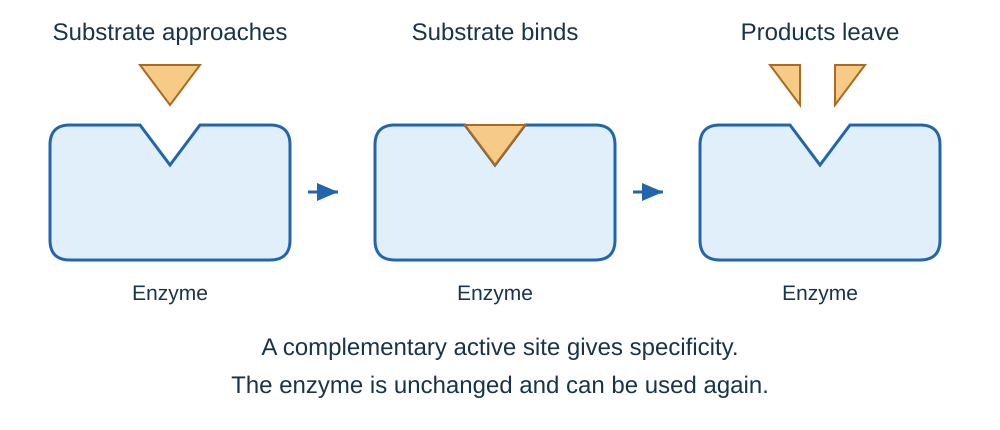
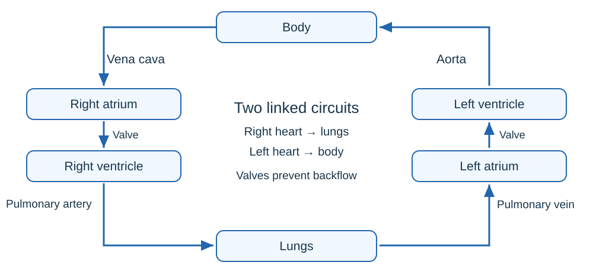
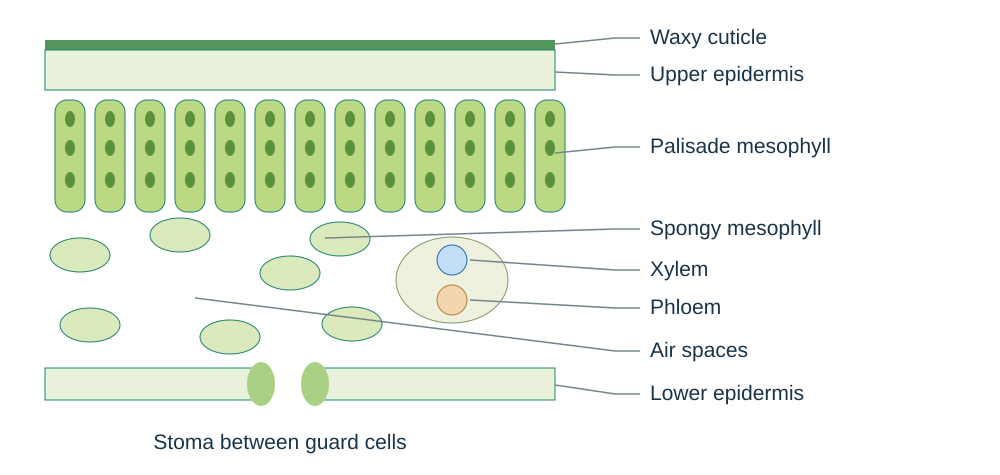

# Organisation

## Cells, tissues and digestion

A body is like a team: small units work together on larger jobs.

- **Cells → tissues → organs → organ systems → organism.** A tissue contains cells with similar structure and function. An organ contains different tissues working together.
- The stomach contains muscular tissue to mix food, glandular tissue to release digestive juices and epithelial tissue to cover surfaces. It belongs to the digestive system.
- **Digestion** breaks large, insoluble food molecules into small, soluble molecules. **Absorption** moves these products through the small-intestine wall into the blood.

| Part | Main job |
| --- | --- |
| Mouth and salivary glands | Chewing increases surface area; saliva contains amylase |
| Oesophagus | Muscular contractions move food to the stomach |
| Stomach | Churns food; releases protease and acid; acid kills many microbes and provides a suitable pH |
| Liver | Makes bile |
| Gall bladder | Stores bile and releases it into the small intestine |
| Pancreas | Releases digestive enzymes into the small intestine |
| Small intestine | Completes digestion and absorbs products into blood |
| Large intestine | Absorbs water from remaining material |
| Rectum and anus | Store and remove faeces |

**Egestion** removes undigested food. **Excretion** removes metabolic waste, such as urea. Do not confuse them.

## Enzymes and their products

An enzyme is like a reusable tool shaped for one job. Its **active site** fits a particular substrate.

- Enzymes are **protein biological catalysts**. They speed up reactions without being used up.
- The substrate binds to the active site, products form and leave, and the enzyme can be reused. This is the simplified **lock-and-key model**.
- At low temperature, molecules have less kinetic energy: fewer successful collisions. Warming increases rate up to an optimum.
- Excess heat changes the active-site shape: the enzyme is **denatured**, so the substrate no longer fits. Cold usually slows enzymes rather than denaturing them.
- Each enzyme has an optimum pH. A pH too far from this can alter the active site and reduce activity.

| Enzyme | Produced in | Substrate | Products |
| --- | --- | --- | --- |
| Amylase, a carbohydrase | Salivary glands, pancreas, small intestine | Starch | Sugars |
| Proteases | Stomach, pancreas, small intestine | Proteins | Amino acids |
| Lipases | Pancreas, small intestine | Lipids | Glycerol and fatty acids |

Products are used to build new carbohydrates, proteins and lipids. Some glucose is used in respiration.

**Bile is not an enzyme.** It is alkaline, so it neutralises acid arriving from the stomach. It also **emulsifies fat** into small droplets. This increases the surface area available to lipase; suitable alkaline conditions also help lipase work.

### Reading enzyme graphs

- A steep rise shows that rate is increasing rapidly. The peak gives the optimum for the conditions tested.
- A fall above the optimum temperature is explained by **denaturation**, not by the enzyme being used up.
- Compare rates only when substrate amount, enzyme concentration and other conditions are controlled.
- **Rate = amount of product formed ÷ time**, or amount of substrate used ÷ time. Always include the units.

## Food tests

Use separate samples so one reagent does not affect the next test. Crush solid food in distilled water; filter if necessary. Include a known positive sample and distilled water as a negative control.

| Substance | Method | Positive result |
| --- | --- | --- |
| Reducing sugar | Add Benedict’s solution; heat in a hot water bath | Blue changes through green/yellow/orange to brick-red precipitate |
| Starch | Add iodine solution | Orange-brown becomes blue-black |
| Protein | Add Biuret reagent | Blue becomes lilac/purple |
| Lipid | Add Sudan III and shake gently | A red-stained oil layer separates |

- These are **qualitative** tests: they identify substances, not an exact concentration. Benedict’s colour only suggests an approximate amount if volumes, temperature and time are controlled.
- Wear eye protection. Use a water bath and test-tube rack for heating. Handle irritant/corrosive reagents as instructed.
- An alternative lipid test uses ethanol followed by water: a **milky emulsion** indicates lipid. Ethanol is flammable: keep it away from flames and hot equipment.

## Investigating amylase and pH

Find how quickly amylase removes starch at different pH values.

1. Put iodine drops in a spotting tile. Set a water bath to a fixed temperature and let the solutions reach that temperature.
2. Mix measured volumes of starch and a pH buffer. Add a measured volume and concentration of amylase; start the timer.
3. Every **30 seconds**, put a fresh sample onto a fresh iodine drop. Do not add iodine to the reaction mixture.
4. Record the first time iodine remains orange-brown: no starch is detected. Repeat for a range of pH values.
5. Keep temperature, enzyme/starch concentrations and volumes the same. Change only pH.
6. Repeat each condition; calculate means and identify any anomalous results for checking.

For the same starting amount of starch, **relative rate = 1 ÷ time**. A reaction taking 60 s has a relative rate of 1/60 = **0.0167 s⁻¹**. A shorter time means a faster reaction.

Plot pH against rate. The highest rate identifies the optimum in this experiment. State whether you averaged the times before calculating rates or averaged individual rates; use the same method throughout.

The true endpoint lies between the last positive starch test and the first negative one. Shorter sampling intervals improve its resolution. Do not discard a result just because it does not fit your prediction.

## The heart and double circulation

Blood travels through two linked circuits: one to collect oxygen, one to deliver it. Think of the heart as two pumps working side by side.

- **Body → vena cava → right atrium → right ventricle → pulmonary artery → lungs.**
- **Lungs → pulmonary vein → left atrium → left ventricle → aorta → body.**
- Blood passes through the heart twice in a complete circuit: **double circulation**.

- Atria receive blood; ventricles pump it out. **Valves prevent backflow**. The septum separates the two sides.
- The **left ventricle has a thicker muscular wall** because it pumps around the body at higher pressure. The right ventricle pumps only to the lungs.
- **Coronary arteries** supply the heart muscle with oxygen and glucose.
- A group of cells in the **right atrium** is the natural pacemaker. Artificial pacemakers supply electrical impulses to correct irregular heartbeats.

### Calculating blood flow

**Cardiac output = heart rate × stroke volume.** Stroke volume is blood pumped per beat.

70 beats/min × 75 cm³/beat = **5,250 cm³/min**, or **5.25 dm³/min**. Check that the time and volume units match the question.

## Blood, vessels and lungs

An artery is an outgoing pressure pipe; a capillary is an exchange surface; a vein returns blood.

| Vessel | Structure linked to function |
| --- | --- |
| Artery | Thick muscular and elastic wall withstands high pressure; carries blood away from heart |
| Vein | Wide lumen reduces resistance at low pressure; valves prevent backflow; carries blood towards heart |
| Capillary | Wall one cell thick gives a short diffusion distance; extensive networks provide large exchange area |

**Artery does not mean oxygenated.** The pulmonary artery carries deoxygenated blood; the pulmonary vein carries oxygenated blood.

| Blood component | Function and recognisable features |
| --- | --- |
| Red blood cell | Haemoglobin binds oxygen; biconcave shape increases area; no nucleus leaves more space for haemoglobin |
| White blood cell | Has a nucleus; defends through phagocytosis and antibody/antitoxin production |
| Platelet | Small cell fragment involved in clotting, reducing blood loss and pathogen entry |
| Plasma | Liquid carrying cells and dissolved glucose, amino acids, hormones, carbon dioxide and urea; distributes thermal energy |

Air travels through **trachea → bronchi → smaller airways → alveoli**. Many alveoli provide a large area; moist, thin alveolar and capillary walls give a short diffusion path. Ventilation replenishes air and blood flow removes absorbed oxygen, maintaining steep gradients. **Oxygen diffuses into blood; carbon dioxide diffuses into alveoli.**

When recognising a blood micrograph, use visible evidence: red cells are numerous and lack nuclei; white cells have a visible nucleus; platelets are much smaller fragments.

## Coronary heart disease and treatments

**Coronary heart disease:** fatty deposits narrow coronary arteries. Less blood reaches heart muscle, so less oxygen is available for aerobic respiration. A blockage can cause a heart attack.

| Treatment | Benefit | Limitation or risk |
| --- | --- | --- |
| Stent | Holds an artery open and rapidly improves blood flow | Procedure risks; blood clots can form |
| Statin | Lowers cholesterol and slows fatty-deposit formation | Long-term use; possible side effects |
| Replacement valve | Restores effective one-way flow | Surgery; mechanical valves may need anticoagulants; biological valves may wear out |
| Donor heart | Can restore pumping in heart failure | Donor shortage; surgery, rejection and immunosuppressant risks |
| Artificial heart | Supports circulation while awaiting transplant or recovery | Infection/clot risks; power and equipment limitations |

A leaking valve permits backflow; a valve that fails to open fully restricts flow. Both reduce effective pumping. Compare treatments using the **patient’s condition**, expected benefit and risk rather than saying one is always best.

## Health, risk factors and cancer

**Health** means physical and mental well-being. Diet, stress and life circumstances affect it, as can communicable and non-communicable disease.

- Diseases interact: immune-system defects increase infection risk; some viruses trigger cancers; infection can trigger immune reactions such as allergies; severe physical illness can contribute to depression.
- A **risk factor** increases the chance of disease; it does not guarantee disease. Smoking, poor diet and inactivity increase cardiovascular risk. Obesity increases Type 2 diabetes risk.
- Smoking damages lungs and raises lung-cancer risk. Alcohol can damage the liver and brain. Smoking and alcohol during pregnancy can harm fetal development.
- Ionising radiation and other **carcinogens** can cause mutations. Inherited genetic factors can also affect cancer risk.
- **Cancer** involves changes in cells leading to uncontrolled growth and division. **Benign** tumours stay local; **malignant** tumours invade tissues, and cells can spread in blood to form secondary tumours.

### Evaluating disease data

**Correlation alone does not establish causation.** For example, age or other habits could explain part of an association. Stronger evidence includes representative large samples, repeated studies and a plausible biological mechanism.

- Compare disease rates using the same denominator, such as cases per 100,000 people. Raw totals can mislead when populations differ.
- Distinguish relative changes from percentage-point changes: a rise from 2% to 3% is a 1 percentage-point increase but a 50% relative increase.
- Consider personal suffering, lost work, caring responsibilities and treatment costs for individuals, families, communities and health services.

## Leaf tissues

A leaf is like a solar panel with pipes and adjustable air vents.

- **Epidermis** protects the leaf; the waxy cuticle reduces evaporation. A transparent upper surface lets light through.
- **Palisade mesophyll** lies near the upper surface and is packed with chloroplasts to absorb light.
- **Spongy mesophyll** contains air spaces for diffusion between stomata and photosynthesising cells.
- **Xylem and phloem** form transport bundles. **Guard cells** surround stomata and control opening, balancing gas exchange against water loss.
- **Meristem tissue** at growing root/shoot tips contains dividing cells that can differentiate.

On a cross-section, link each visible layer to its job. An air space is not a cell. A **stoma is a pore** between guard cells.

## Transpiration and translocation

**Transpiration** is water loss from leaves: water evaporates from moist mesophyll surfaces, then water vapour diffuses out through stomata. This helps pull a continuous stream of water up xylem.

- Root hairs provide large area: water enters by **osmosis**, while mineral ions can enter by **active transport**.
- **Xylem:** dead, hollow tubes strengthened by lignin; water and mineral ions travel from roots towards leaves.
- **Phloem:** living elongated cells with pores in end walls. **Translocation** moves dissolved sugars from sources such as leaves to growing or storage tissues. Different tubes can carry sugars in different directions.

| Change | Usual effect on transpiration | Explanation |
| --- | --- | --- |
| Higher temperature | Faster | Faster evaporation and diffusion |
| More air movement | Faster | Removes humid air, maintaining the water-vapour gradient |
| Higher humidity | Slower | Smaller difference in water-vapour concentration |
| Greater light intensity | Faster, if water is available | Stomata usually open for gas exchange |

### Measuring water uptake

A **potometer measures water uptake**, an estimate of transpiration; some water is used or stored in the plant.

1. Cut the shoot under water to prevent air entering the xylem. Assemble the apparatus airtight and watertight; dry the leaves.
2. Introduce an air bubble into the capillary. Allow the shoot to adjust to conditions.
3. Measure bubble distance in a fixed time; reset and repeat.
4. Change one factor, controlling other conditions and using the same shoot or comparable leaf area.

**Bubble movement rate = distance ÷ time.** To find water volume, use **volume = πr² × distance**, where r is the capillary radius; then divide by time for volume uptake rate.

Leaks give misleading results. Repeat measurements and compare means. Stomatal density can be estimated by counting stomata in several randomly selected, measured microscope areas, then calculating a mean per unit area.

## Sources

- [AQA Biology specification](../../00%20-%20Specification/AQA-8461-specification.pdf)
