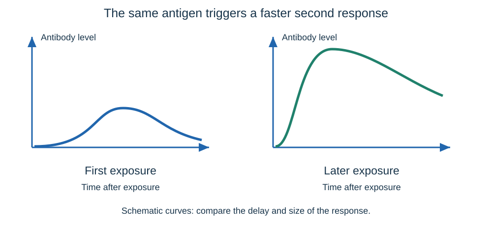
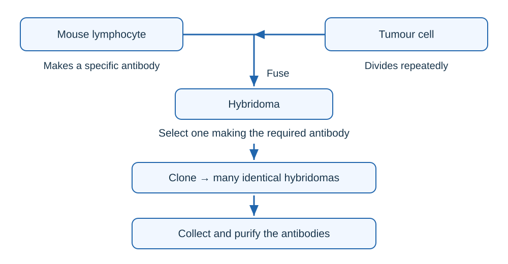

# Infection and response

## Pathogens and transmission

A **pathogen** is a microorganism that causes disease. A **communicable disease** can pass between organisms. Think of the body as a building: barriers keep intruders out, while the immune system deals with those that get inside.

- **Bacteria** are cells that can multiply rapidly inside the body. They may release **toxins** that damage tissues and make us ill.
- **Viruses** reproduce inside living cells, damaging or destroying them. They are much smaller than bacteria.
- **Fungi** and **protists** can also cause disease. A mosquito carries the malaria protist; the mosquito is the **vector**, not the pathogen.
- Pathogens spread by **direct contact, water or air**. Contaminated food and animal vectors provide other routes.

Break the route to stop spread: clean water and hygiene reduce contamination; isolating infected individuals reduces contact; controlling vectors reduces transmission; vaccination protects susceptible people. Match the action to the actual route rather than giving the same prevention for every disease.

## Human infections

### Measles and HIV

| Disease | Cause and spread | Effects and control |
|---|---|---|
| Measles | Virus; droplets from coughs and sneezes are inhaled | **Fever and red skin rash**; serious complications can be fatal. Vaccination reduces illness and spread. |
| HIV | Virus; sexual contact or exchange of body fluids, including blood from shared needles | Early flu-like illness. Attacks **immune cells**. Antiretroviral drugs control viral multiplication. Condoms and avoiding shared needles reduce transmission. |

**AIDS** is the late stage of HIV infection when the immune system is severely damaged. The person becomes vulnerable to other infections and some cancers. HIV and AIDS are not two different pathogens; antibiotics do not treat HIV.

### Salmonella and gonorrhoea

| Disease | Cause and spread | Effects and control |
|---|---|---|
| Salmonella food poisoning | Bacteria swallowed in contaminated food, including food prepared unhygienically | **Fever, abdominal cramps, vomiting and diarrhoea** caused by bacteria and their toxins. Food hygiene, thorough cooking and vaccination of poultry reduce spread. |
| Gonorrhoea | Bacterium; sexual contact | **Pain on urinating** and a thick yellow or green discharge. Condoms reduce spread. Appropriate antibiotics treat infection, but resistant strains make treatment harder. |

### Malaria

- A **protist** causes malaria. It has a life cycle involving mosquitoes, which transfer the pathogen between people.
- Symptoms include **recurrent fever**; malaria can be fatal.
- **Mosquito nets** reduce bites. Preventing mosquitoes from breeding reduces the number of vectors.
- Removing suitable standing-water breeding sites targets the vector's life cycle, rather than treating an infected person.

## Barriers and white blood cells

The first defences are **non-specific**: they act against many kinds of pathogen.

| Defence | How it helps |
|---|---|
| Skin | Physical barrier. Blood clotting seals cuts; antimicrobial substances help reduce pathogens. |
| Nose | Hairs and mucus trap particles and pathogens. |
| Trachea and bronchi | Mucus traps pathogens; **cilia move mucus towards the throat** to be swallowed. |
| Stomach | **Hydrochloric acid** kills many swallowed pathogens. |

If pathogens get through, **white blood cells** defend the body in three main ways:

- **Phagocytosis:** a white blood cell engulfs and digests a pathogen.
- **Antibody production:** antibodies bind to specific **antigens** on a pathogen, helping the immune system destroy it. The binding shapes are complementary, like a key fitting one lock.
- **Antitoxin production:** antitoxins neutralise the toxins released by bacteria. They do not directly kill the bacteria.

Antibodies and antitoxins are different. Different kinds of white blood cell perform different roles; do not say that every white blood cell performs all three.

## Vaccination

A vaccine gives the immune system a safe first encounter with a pathogen's antigens, like showing security staff a photograph before the intruder arrives.

1. A vaccine introduces a small quantity of **dead or inactive pathogen**, or its antigens.
2. White blood cells recognise the antigens and make **specific antibodies**.
3. Some cells remain as **memory cells**.
4. If the same pathogen enters later, the correct antibodies are produced **more quickly and in greater amounts**.
5. The pathogen is destroyed before it can cause significant illness.

When a large proportion of the population is immune, an infected person has fewer susceptible people to pass the pathogen to. This reduces transmission and helps protect people who cannot be vaccinated. Protection is less effective if uptake is low; vaccination does not guarantee that every individual is protected.

When evaluating a vaccination programme, compare the reduction in disease and spread with reliable evidence about risks, cost, access and uptake. Use the data given rather than assuming all vaccines have the same effects.

## Antibiotics and other medicines

- **Antibiotics** treat bacterial disease by killing bacteria or preventing their growth. Different bacteria may need different antibiotics.
- **Antibiotics do not kill viruses.** Viruses reproduce inside body cells, so it is difficult to target them without damaging the body's own tissues.
- **Painkillers** reduce symptoms such as pain; they do not kill the pathogen causing the infection.
- **Resistant bacteria** survive an antibiotic that previously worked. Infections become harder to treat and new treatments take time and money to develop.

An antibiotic targets the cause of a suitable bacterial infection; a painkiller targets a symptom. Treating symptoms does not necessarily stop someone spreading a pathogen.

## Developing new drugs

### Where drugs come from

- **Digitalis:** a heart drug originally obtained from **foxgloves**.
- **Aspirin:** developed from chemicals found in **willow**.
- **Penicillin:** discovered by **Alexander Fleming** from the **Penicillium mould**.
- Most new drugs are now synthesised by chemists. A natural substance may still provide the starting point.

### Testing sequence

A promising chemical must pass several checks, like a new car being tested before passengers ride in it.

| Stage | What happens and why |
|---|---|
| Preclinical testing | Test on **cells, tissues and live animals** to investigate effects and possible harm. |
| Early clinical trials | Give **very low doses to healthy volunteers** to investigate safety. |
| Further clinical trials | Test on **patients** to see how well the treatment works and find the **optimum dose**. |
| Review | Other scientists examine the methods and results through **peer review** before publication. |

The three key checks are **toxicity** (harmful effects), **efficacy** (whether it works) and **dose** (how much gives a useful effect with acceptable risk).

- A **placebo** resembles the treatment but contains no active drug. It helps separate the drug's effect from expectations and other changes.
- In a **double-blind trial**, neither the patients nor the researchers assessing them know who receives the drug until the results are analysed. This reduces bias.
- **Random allocation**, a large sample and comparable groups help make the comparison fair. Compare recovery rates and side effects, not just the number who recovered.
- A placebo is used when appropriate; some trials compare a new drug with an existing treatment.

Example: 60 of 100 patients improve with a drug and 35 of 100 with a placebo. Improvement is **60% versus 35%**, a difference of **25 percentage points**. Consider sample size, side effects and whether the groups were comparable before judging the drug.

## Monoclonal antibodies

**Monoclonal antibodies** come from one clone of cells. They bind to **one specific binding site on one protein antigen**. Think of a batch of identical address labels: each directs a test or treatment to the same target.

### How they are made

1. Introduce an antigen into a mouse, stimulating **lymphocytes** to produce the required antibody.
2. Collect the lymphocytes and fuse them with **tumour cells**.
3. The resulting **hybridoma** can both **divide repeatedly and produce the antibody**.
4. Select a hybridoma making the desired antibody and **clone** it.
5. Grow many identical cells, then **collect and purify** the antibodies they release.

The two parent cells contribute different useful features. A lymphocyte makes the specific antibody; the tumour cell supplies the ability to keep dividing.

### Uses, benefits and limits

| Use | Why specificity matters |
|---|---|
| Pregnancy tests | Antibodies bind to a pregnancy-associated hormone in urine, producing a detectable signal. |
| Laboratory diagnosis | Detect pathogens or measure hormones and other chemicals in blood. |
| Research | An antibody carrying a **fluorescent dye** binds to a particular molecule, revealing its location in cells or tissues. |
| Cancer treatment | An antibody can deliver a **toxic drug, radioactive substance or growth-blocking chemical** to cells bearing the target antigen. |

Targeted treatment aims to reduce damage to other cells compared with a less selective treatment. However, monoclonal antibodies can still cause **side effects**, and not every cancer has a suitable target. Early expectations of widespread treatment were limited by unexpected side effects. Judge any particular treatment from the evidence supplied.

For an unfamiliar test, identify **the antigen → the antibody that binds it → the visible signal or delivered treatment**. You do not need to memorise a detailed mechanism for every commercial test.

## Plant infections and deficiencies

Plants can show poor growth for several reasons. A yellow leaf is a clue, not a diagnosis: infection and a mineral shortage can produce similar symptoms.

| Problem | Cause and signs | Effect or response |
|---|---|---|
| Tobacco mosaic virus (TMV) | Virus; **mosaic-pattern discolouration** of leaves | Less photosynthesis means less glucose for growth. Reduce transfer on contaminated tools or contact with infected material. |
| Rose black spot | Fungus; **purple/black spots**, yellowing and early leaf fall | Less photosynthesis reduces growth. Spores spread by **wind or water**. Remove/destroy affected leaves and use fungicides. |
| Aphids | Insect pests feeding on sugar-rich sap | Remove substances the plant needs, reducing growth; may also transfer viruses. |
| Nitrate deficiency | Too few nitrate ions; **stunted growth** | Nitrates are needed to make **amino acids and proteins**. |
| Magnesium deficiency | Too few magnesium ions; yellowing called **chlorosis** | Magnesium is needed to make **chlorophyll**, so photosynthesis falls. |

Mineral deficiency is **not communicable**. Adding an appropriate mineral can correct a shortage but will not cure a viral infection.

### Detecting and identifying disease

Signs include **stunted growth, leaf spots, decay, unusual growths, malformed stems or leaves, discolouration and visible pests**.

- Compare symptoms with a reliable **gardening manual or website**.
- Send infected material to a **laboratory** to identify a pathogen.
- Use a **testing kit containing monoclonal antibodies** for a particular pathogen.
- Combine evidence. Similar symptoms may have different causes, and a test for one pathogen cannot rule out every other problem.

## Plant defences

Plants have barriers, chemicals and adaptations that discourage attackers. Think of a garden protected by a wall, a chemical deterrent and sharp fencing.

| Type | Examples and function |
|---|---|
| Physical | **Cellulose cell walls** and a **tough waxy cuticle** resist entry by microorganisms. **Bark** forms a protective layer; shedding dead bark can remove pathogens. |
| Chemical | **Antibacterial chemicals** act against bacteria; **poisons** deter herbivores. |
| Mechanical adaptations | **Thorns and hairs** deter animals; leaves may **droop or curl when touched**; **mimicry** can trick animals into avoiding a plant. |

Link each feature to how it protects the plant. A thorn deters feeding; it does not make antibodies or kill every pathogen.
