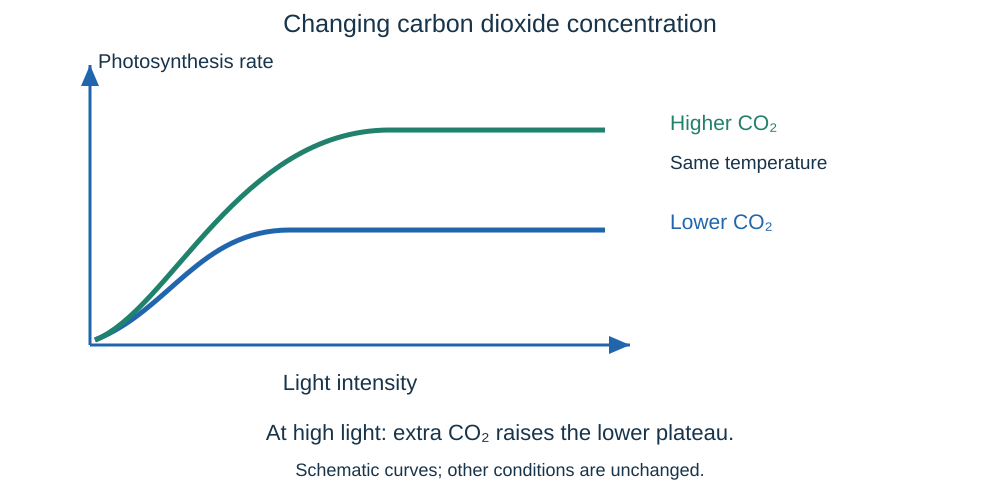

# Bioenergetics questions & answers

## 1 mark

**1.** Name the green pigment that absorbs light for photosynthesis.

**Answer:** Chlorophyll.

**2.** Is photosynthesis endothermic or exothermic?

**Answer:** Endothermic.

**3.** Name the gas released by photosynthesis.

**Answer:** Oxygen.

**4.** Name the product of anaerobic respiration in human muscles.

**Answer:** Lactic acid.

**5.** What is metabolism?

**Answer:** The sum of all chemical reactions in a cell or the body.

**6.** Name the insoluble carbohydrate used to store glucose in plants.

**Answer:** Starch.

**7.** Name the process in which yeast respires anaerobically to produce ethanol.

**Answer:** Fermentation.

## 2 marks

**8.** Write the word equation for photosynthesis.

**Answer:** **Carbon dioxide + water → glucose + oxygen**, using light absorbed by chlorophyll.

**9.** Explain why a plant needs nitrate ions as well as glucose to make proteins.

**Answer:**

- Nitrates supply nitrogen needed to make **amino acids**.
- Amino acids are joined to make **proteins** for growth and other functions.

**10.** Pondweed produces 4.5 cm³ of oxygen in 3 minutes. Calculate the mean oxygen-production rate, including its unit.

**Answer:** **Rate = 4.5 ÷ 3 = 1.5 cm³/min.**

**11.** Explain why sodium hydrogencarbonate solution is used in a pondweed photosynthesis investigation.

**Answer:**

- It provides a source of **carbon dioxide**.
- Carbon dioxide is a **reactant in photosynthesis**.

**12.** Why is counting bubbles less reliable than measuring the volume of gas produced?

**Answer:**

- Bubbles can have **different volumes**.
- Equal bubble counts may therefore represent different gas volumes; collecting gas gives a more direct measure of **volume per unit time**.

**13.** A lamp is moved from 15 cm to 30 cm from a plant. Use the inverse-square law to calculate the new light intensity as a fraction of the original.

**Answer:**

- New/original intensity = (15 ÷ 30)².
- New intensity = **¼ of the original**.

**14.** Explain why anaerobic respiration transfers less energy per glucose molecule than aerobic respiration.

**Answer:**

- Glucose is **incompletely broken down/oxidised** in anaerobic respiration.
- More chemical energy remains in its products, so **less energy is transferred** for cell processes.

**15.** Explain how yeast makes bread dough rise.

**Answer:**

- Yeast carries out **fermentation**, producing carbon dioxide from sugar.
- Gas bubbles are trapped in the dough, making it **expand**.

**16.** A student counts 23 heartbeats in 15 seconds. Calculate heart rate in beats per minute.

**Answer:** **23 × 4 = 92 beats/min.**

## 3 marks

**17.** Explain why photosynthesis can slow down at temperatures above the optimum.

**Answer:**

- Photosynthesis involves **enzyme-controlled reactions**.
- High temperatures can **denature enzymes**, changing their active-site shapes.
- Fewer substrates bind successfully, so the reactions and overall photosynthesis slow down.

**18.** A lamp is moved from 40 cm to 20 cm. Calculate the change in intensity and explain why photosynthesis rate may not increase by the same factor.

**Answer:**

- Intensity ratio = (40 ÷ 20)².
- Light intensity becomes **four times** as great.
- Another factor, such as CO₂ concentration or temperature, may now be **limiting**, so rate need not quadruple.

**19.** A greenhouse grower can add lighting at a cost of £180 per week, increasing crop income by £250. Adding CO₂ as well costs a further £100 but brings only £60 extra income. Calculate the extra profit from lighting alone and from both changes, and recommend an option.

**Answer:**

- Lighting alone: £250 − £180 = **£70 extra profit/week**.
- Both: (£250 + £60) − (£180 + £100) = **£30 extra profit/week**.
- Choose **lighting alone** on these figures, because its extra profit is £40 greater; adding CO₂ would reduce profit.

**20.** Compare aerobic respiration with anaerobic respiration in muscles in terms of oxygen, products and energy transfer.

**Answer:**

- Aerobic respiration **uses oxygen**; anaerobic respiration does not.
- Aerobic products are **carbon dioxide and water**; the muscle anaerobic product is **lactic acid**.
- Aerobic respiration transfers **much more energy per glucose molecule**.

**21.** Explain why breathing stays faster and deeper for a while after vigorous exercise.

**Answer:**

- Anaerobic respiration during exercise causes **lactic acid to accumulate**.
- The body needs **extra oxygen** afterwards to deal with it: the **oxygen debt**.
- Faster, deeper breathing supplies that additional oxygen during recovery.

**22.** Explain how magnesium deficiency can reduce the supply of glucose in a plant.

**Answer:**

- Magnesium is needed to make **chlorophyll**.
- Less chlorophyll means less **light absorption**.
- The rate of photosynthesis falls, so less **glucose** is made.

**23.** State the small molecules needed to make a lipid molecule and a protein. Explain where energy for these building reactions comes from.

**Answer:**

- A lipid molecule is formed from **one glycerol and three fatty acids**.
- A protein is formed from **amino acids**.
- **Respiration transfers energy** for the enzyme-controlled building reactions.

**24.** A plant is kept in bright light but cannot take in any carbon dioxide. Explain why it cannot continue building up starch through photosynthesis.

**Answer:**

- Carbon dioxide is a **reactant in photosynthesis**.
- Without it, photosynthesis cannot continue producing glucose.
- There is no new photosynthetic glucose to convert into **starch**; stored materials may still be used in respiration.

## 4 marks

**25.** Use the graph to explain the rising sections, the lower plateau and what happens when CO₂ is increased at high light. State what cannot be concluded from the upper plateau alone.

**Answer:**

- Where the curves rise, increasing light increases the rate, so **light is limiting** under those conditions.
- At the lower plateau, extra light alone cannot raise the rate.
- Higher CO₂ raises the rate at the same high light and temperature, showing **CO₂ limited the lower plateau**.
- The upper plateau shows another limit, but it does not by itself identify that factor; further controlled comparisons are needed.

**26.** Explain how the body responds during vigorous exercise and why muscles may still become fatigued.

**Answer:**

- **Heart rate increases**, supplying muscles with more oxygenated blood.
- **Breathing rate and breath volume increase**, taking in more oxygen for aerobic respiration.
- If oxygen supply cannot meet demand, **anaerobic respiration increases**, producing lactic acid.
- Lactic acid builds up and muscles become **fatigued**, contracting less efficiently during prolonged vigorous activity.

**27.** Explain what happens to lactic acid after vigorous exercise and define oxygen debt.

**Answer:**

- Lactic acid moves from muscles into the **blood**.
- Blood transports it to the **liver**.
- The liver converts it back into **glucose**.
- **Oxygen debt** is the extra oxygen required after exercise to deal with accumulated lactic acid and remove it from cells.

**28.** In a pondweed investigation, moving the lamp closer increases both light intensity and water temperature. Explain why this is a problem and give improvements to measurement and experimental control.

**Answer:**

- Two factors change, so a rate increase cannot be attributed to **light intensity alone**.
- Use a **water bath or heat shield** and monitor temperature to keep it constant.
- Measure **gas volume per fixed time**, rather than relying only on variable-sized bubbles.
- Allow acclimatisation and repeat each condition, keeping CO₂ supply and the pondweed constant, then calculate a mean.

**29.** Three repeat oxygen volumes over 5 minutes are 3.0, 3.5 and 4.0 cm³. Calculate the mean volume and mean rate. Explain why repeating does not fix a leak in the apparatus.

**Answer:**

- Mean volume = (3.0 + 3.5 + 4.0) ÷ 3 = **3.5 cm³**.
- Mean rate = 3.5 ÷ 5.
- Rate = **0.70 cm³/min**.
- A leak consistently loses gas, giving an underestimate; repeating reduces random variation but does not remove this **systematic error**.

## 6 marks

**30.** Describe an investigation into how light intensity affects photosynthesis in pondweed. Explain the controls and how you would compare the results.

**Answer:**

- Put the same pondweed in a fixed volume and concentration of **sodium hydrogencarbonate solution** to keep the CO₂ supply similar.
- Place a lamp at several measured distances, keeping plant orientation and background light unchanged. **Allow acclimatisation** after each change.
- Use a water bath or heat shield and monitor with a thermometer so **temperature stays constant**.
- Collect oxygen in an inverted water-filled measuring tube for a fixed time; calculate **volume/time**. Check for leaks.
- Repeat each distance and calculate mean rates. Measuring volume avoids the problem of unequal bubble sizes.
- Plot mean rate against **light intensity or 1/distance²**, label axes and units, and draw a suitable curve. Keep electrics clear of water and avoid hot-lamp burns.

**31.** Design an investigation to compare the effect of two safe types of exercise on heart rate. Explain how you would make the comparison fair and reliable.

**Answer:**

- Recruit suitable participants and use safe, moderate activities. Account for health restrictions and stop if anyone feels unwell.
- Measure each person’s **resting heart rate**, then have them perform both activities in a randomised order.
- Use the **same duration** and define the pace or intensity for each activity. Allow pulse to return to its resting level between trials.
- Measure pulse immediately after each activity using the same method and timing; a delay would allow recovery and change the result.
- Repeat and calculate each person’s **increase from resting rate**, then compare mean increases for the two activities.
- Using the same people reduces differences due to age or fitness; using several participants and repeats reduces the influence of individual variation.

**32.** Explain how photosynthesis, respiration and metabolism together allow a plant to grow.

**Answer:**

- **Photosynthesis** transfers light energy into chemical energy, producing glucose from CO₂ and water.
- **Respiration** breaks down some glucose and transfers energy for building new molecules and other cell processes.
- Glucose is converted into **cellulose** for new cell walls and into **starch or fats/oils** for storage.
- Glucose and nitrate-derived nitrogen are used to make **amino acids**, which are joined into proteins for growth and enzymes.
- **Glycerol and fatty acids** are joined into lipids used in cell structures and storage.
- These building and breakdown reactions are part of **metabolism**, the sum of all reactions, and are controlled by enzymes. The plant needs both materials and energy to form new cells.

## Past-paper sources

These are original practice questions, informed by the AQA papers below and the current course specification. The answers are tutor-written; the linked mark schemes show the official answers to the original papers.

### Resource directory

- [AQA assessment resources](https://www.aqa.org.uk/subjects/biology/gcse/biology-8461/assessment-resources) — official papers and mark schemes.
- [Physics & Maths Tutor](https://www.physicsandmathstutor.com/past-papers/gcse-biology/aqa-paper-1/) — paper archive.
- [Revision Science](https://revisionscience.com/gcse-revision/biology/biology-gcse-past-papers/aqa-gcse-biology-past-papers) — alternative archive.

### Papers used

- June 2022, Paper 1 Higher: [question paper](../../00 - Past papers/Paper 1 Higher/AQA-84611H-QP-JUN22.pdf) · [mark scheme](../../00 - Past papers/Paper 1 Higher/AQA-84611H-MS-JUN22.pdf).

- June 2023, Paper 1 Higher: [question paper](../../00 - Past papers/Paper 1 Higher/AQA-84611H-QP-JUN23.pdf) · [mark scheme](../../00 - Past papers/Paper 1 Higher/AQA-84611H-MS-JUN23.pdf).

- June 2024, Paper 1 Higher: [question paper](../../00 - Past papers/Paper 1 Higher/AQA-84611H-QP-JUN24.pdf) · [mark scheme](../../00 - Past papers/Paper 1 Higher/AQA-84611H-MS-JUN24.pdf).

### Question types checked

- Photosynthesis equations and limiting factors: 2023 Q06.1–06.2; 2024 Q07.1–07.3 and Q07.7–07.9.
- Photosynthesis investigations: 2023 Q06.3–06.9; 2024 Q07.6.
- Respiration and exercise: 2023 Q04.1–04.2; 2024 Q02.5.
- Links between glucose, respiration and growth: 2022 Q04.3; 2024 Q02.3.

These themes each appear in at least two papers in the three-paper sample. The practice questions use new wording, values and mark allocations. Extra specification-based questions cover fermentation, metabolism and greenhouse economics.

Additional questions cover the rest of this topic, including practical and mathematical skills. This is a revision selection, not a prediction of the next exam.
