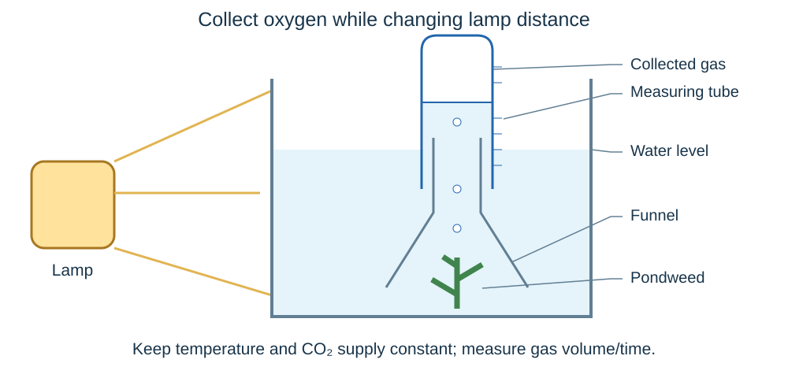

# Bioenergetics

## Photosynthesis

Photosynthesis lets a plant use light to make glucose from simple substances. Think of a leaf as a solar-powered food factory: light supplies energy, while carbon dioxide and water supply the raw materials.

**Carbon dioxide + water → glucose + oxygen**

**6CO₂ + 6H₂O → C₆H₁₂O₆ + 6O₂**

- **Chlorophyll** in chloroplasts absorbs light.
- Photosynthesis is **endothermic**: energy is transferred from the environment to the chloroplasts by light.
- Carbon dioxide enters leaves through **stomata**. Water arrives from the roots through **xylem**.
- Light supplies energy; it is not a material reactant. Glucose stores chemical energy, and oxygen is released.
- Plants **respire all the time**, including in daylight. They photosynthesise only when sufficient light is available.

### Where the glucose goes

| Use | Why the plant needs it |
|---|---|
| **Respiration** | Transfers energy for living processes. |
| **Starch** | Insoluble storage carbohydrate. It does not dissolve and draw water into cells in the way a concentrated sugar solution would. |
| **Fats and oils** | Energy stores, particularly in seeds. |
| **Cellulose** | Strengthens cell walls. |
| **Amino acids → proteins** | Builds enzymes and other cell materials. The plant also needs **nitrate ions from the soil**. |

Glucose is both a fuel and a building material. A plant needs minerals as well as light, carbon dioxide and water to grow normally.

## Limiting factors

A **limiting factor** is the factor currently preventing the rate from increasing. Imagine a sandwich shop with plenty of bread but very little filling: delivering more bread will not increase production until the filling shortage is fixed.

| Factor | Effect on photosynthesis |
|---|---|
| **Light intensity** | More light raises the rate while light is limiting. Eventually another factor limits it. |
| **Carbon dioxide concentration** | More CO₂ supplies more reactant, raising the rate while CO₂ is limiting. |
| **Temperature** | Warming towards the optimum increases enzyme activity. Above the optimum, enzymes can **denature**, reducing the rate. |
| **Amount of chlorophyll** | Less chlorophyll absorbs less light, reducing the potential rate. Disease or magnesium deficiency can reduce chlorophyll. |

### Reading graphs with several factors

- On a rising section of a rate-versus-light graph, extra light raises the rate: **light is limiting** under those conditions.
- A plateau means that **more light alone will not help**. Another factor limits the rate.
- Compare curves where **only one other condition changes**. If increasing CO₂ raises the plateau at the same temperature, CO₂ was limiting at the lower plateau.
- If raising temperature increases the rate at the same light and CO₂, temperature was limiting over that range.
- Do not name the limiting factor from a flat line alone. Use the conditions or comparison provided.
- A higher plateau can still have a limiting factor. It does not mean the plant can photosynthesise infinitely fast.

### Light intensity and distance

For a suitable point-like lamp, with other conditions unchanged:

**Light intensity ∝ 1 ÷ distance²**

**Intensity₂ ÷ intensity₁ = (distance₁ ÷ distance₂)²**

- Double the distance → **one-quarter** of the light intensity.
- Halve the distance → **four times** the light intensity.
- Move a lamp from 20 cm to 30 cm: new intensity = old intensity × (20/30)² = **4/9 of the old intensity**.

Keep distance units consistent. Photosynthesis rate will not necessarily change in the same proportion, because light may no longer be the limiting factor.

### Greenhouses and profit

Growers can add light, heat or carbon dioxide to increase photosynthesis and crop yield. But the best setting must also pay for itself.

- Improve the **limiting factor** first. Extra CO₂ is wasteful when light is too low to use it.
- Consider the interacting effects: warming a greenhouse can help until temperature becomes unsuitable or another factor limits the rate.
- Compare **extra income from the crop** with the **extra cost** of lighting, heating and CO₂.
- Example: extra lighting increases crop income by £240 but costs £170. Extra profit = **£70**. If it costs £270, profit falls by **£30**.

Maximum photosynthesis rate and maximum profit are not always achieved at the same settings.

## Investigating light and photosynthesis

The aim is to test how light intensity affects photosynthesis in an **aquatic plant such as pondweed**.

### Method

1. Put a piece of pondweed into sodium hydrogencarbonate solution, which provides a carbon dioxide source. Keep the concentration and volume the same in each trial.
2. Position a lamp at a measured distance. Measure distance consistently from the light source to the pondweed.
3. Keep **temperature constant**, using a water bath or heat shield and a thermometer. A lamp can heat the water as well as illuminate it.
4. Let the plant **acclimatise** before recording. Measure the **volume of oxygen collected in a fixed time**, or count bubbles for that time.
5. Repeat at several distances, covering a useful range. Keep the same pondweed, its orientation, CO₂ supply, measurement time and background lighting.
6. Repeat measurements at each distance and calculate a **mean rate**. Investigate unusual results instead of discarding them automatically.

**Rate = volume of oxygen ÷ time**

Example: 3.6 cm³ in 4 minutes gives **0.90 cm³/min**. If counting bubbles, 48 in 2 minutes gives **24 bubbles/min**.

### Making the result more trustworthy

- **Bubble size varies**, so bubbles per minute are only an estimate of gas production. Measuring gas volume is usually a better comparison.
- Some oxygen dissolves in water or is used in respiration, so collected gas estimates photosynthesis rather than measuring all oxygen produced.
- Use enough collection time to get a measurable volume; check that gas does not leak or escape the collector.
- Control heating: otherwise temperature changes as well as light intensity, making the cause unclear.
- Plot **rate** on the vertical axis against **light intensity or 1/distance²** on the horizontal axis. Use units, an appropriate scale and a suitable best-fit line or curve.
- Keep electrical equipment away from spills. Handle hot lamps and glassware carefully.

## Aerobic and anaerobic respiration

**Cellular respiration** transfers energy from glucose for living processes. It happens continuously in living cells and is **exothermic**. Breathing moves air in and out of the lungs; respiration is a chemical process in cells.

Think of glucose as stored fuel. Respiration releases some of its stored energy so the cell can carry out work. Energy is **transferred or released**, not created.

### Aerobic respiration

**Glucose + oxygen → carbon dioxide + water**

**C₆H₁₂O₆ + 6O₂ → 6CO₂ + 6H₂O**

- Uses **oxygen** and fully oxidises glucose.
- Most aerobic respiration takes place in **mitochondria**.
- Transfers much more energy per glucose molecule than anaerobic respiration.
- Energy is needed for **building larger molecules, movement and keeping warm**. It also supports processes such as active transport.

### Comparing the three pathways

| Pathway | Oxygen? | Products from glucose | Relative energy transfer |
|---|---|---|---|
| Aerobic respiration | Required | **Carbon dioxide + water** | More per glucose molecule |
| Anaerobic respiration in muscles | Not required | **Lactic acid** | Much less; incomplete oxidation |
| Anaerobic respiration in plants and yeast | Not required | **Ethanol + carbon dioxide** | Much less; incomplete breakdown |

**In muscles: glucose → lactic acid**

**In plants and yeast: glucose → ethanol + carbon dioxide**

Do not give ethanol as the product in human muscles, or lactic acid as the product in yeast.

### Fermentation

Anaerobic respiration in yeast is called **fermentation**.

- In **bread making**, carbon dioxide bubbles make the dough rise. Baking kills the yeast and most ethanol evaporates.
- In **alcoholic drink production**, ethanol is the useful product.
- Yeast needs a sugar source and suitable temperature. Excessive heat can denature its enzymes; low temperatures slow reactions.

## Exercise and oxygen debt

Muscles need more energy during exercise because they contract more frequently or forcefully.

1. **Heart rate increases**, moving more oxygenated blood to the muscles.
2. **Breathing rate and breath volume increase**, bringing more oxygen into the lungs and removing more carbon dioxide.
3. Increased oxygen and glucose delivery supports a higher rate of **aerobic respiration**.
4. If oxygen supply cannot meet demand, muscles also use more **anaerobic respiration**.
5. Glucose is incompletely oxidised, **lactic acid builds up**, and muscles become fatigued and contract less efficiently during prolonged vigorous activity.

### After exercise

- The extra oxygen needed after exercise to deal with accumulated lactic acid is the **oxygen debt**.
- Breathing and heart rate remain raised for a while, supplying this extra oxygen and transporting substances.
- Blood carries lactic acid from the muscles to the **liver**, where it is **converted back into glucose**.
- Do not say the lungs convert lactic acid into glucose, or that respiration stops when exercise stops.

### Investigating exercise

To compare different activities, measure resting pulse, perform each activity for the **same duration** at a defined intensity, then measure pulse immediately afterwards. Monitor recovery too.

- Use the same participants for each activity where possible, with full recovery between trials. Randomise activity order to reduce order effects.
- Control duration and define pace; fitness, age, medication and health can affect results. Repeat and compare means or changes from resting pulse.
- A pulse counted for 15 seconds is multiplied by **4** to estimate beats/minute. Delays after exercise underestimate the immediate response because recovery has begun.
- Choose safe, moderate activities and account for participants' health; stop if someone feels unwell.

## Metabolism

**Metabolism** is the sum of all chemical reactions in a cell or the body. It includes both building molecules and breaking them down.

Think of a factory with assembly lines and recycling lines. **Enzymes** control the reactions, and energy transferred by respiration supports the building work.

| Reaction | Purpose |
|---|---|
| Glucose → **starch** | Storage in plants. |
| Glucose → **glycogen** | Storage in animals, especially liver and muscles. |
| Glucose → **cellulose** | Plant cell walls. |
| **Glycerol + three fatty acids → lipid** | Makes lipid molecules for storage and cell structures. |
| Glucose + nitrate-derived nitrogen → **amino acids → proteins** | Plants build proteins, including enzymes, for growth and repair. |
| **Respiration** | Breaks down glucose and transfers energy. |
| Breakdown of excess proteins/amino acids → **urea** | Removes excess nitrogen; urea is excreted in urine. |

Digestion and metabolism are connected: digestion supplies small molecules that cells absorb and use to build their own materials. **Respiration is one part of metabolism**, not another name for the whole of metabolism.
