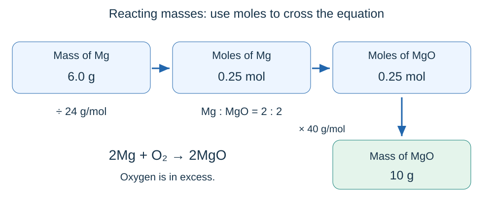

# Quantitative chemistry

## Mass, formulae and equations

A chemical reaction rearranges atoms. Think of dismantling toy-brick models and rebuilding them: the shapes change, but no bricks disappear.

- **Mass is conserved**: in a closed system, total mass of reactants = total mass of products.
- Balance an equation by changing the **numbers in front** of formulae. Never change the small numbers inside a formula.
- **2H₂ + O₂ → 2H₂O** means two hydrogen molecules react with one oxygen molecule to form two water molecules. It also gives the **mole ratio 2 : 1 : 2**. It does not give a mass ratio of 2 : 1 : 2.
- In **2Ca(OH)₂**, there are 2 Ca, 4 O and 4 H atoms altogether.

### Why a measured mass can change

| Observation in an open container | Explanation |
|---|---|
| Magnesium becomes heavier when it burns | Oxygen from the air joins the magnesium; include that oxygen in the starting mass |
| A carbonate and acid mixture becomes lighter | Carbon dioxide escapes into the air; include that gas in the product mass |

No atoms have been destroyed. A closed system retains all reactants and products. **Never seal a gas-producing experiment in ordinary rigid glassware**: pressure can build dangerously.

## Formula mass and percentage composition

**Relative formula mass, Mᵣ**, is the sum of the relative atomic masses, Aᵣ, of all atoms in one formula unit. It has **no unit**.

Using Aᵣ values Ca = 40, O = 16 and H = 1:

**Mᵣ of Ca(OH)₂ = 40 + 2 × (16 + 1) = 74.**

Count brackets carefully. For 2Ca(OH)₂, the Mᵣ of the substance is still 74; the coefficient means twice as much substance.

**Percentage by mass of an element = (total Aᵣ contribution of that element ÷ Mᵣ of compound) × 100.**

For oxygen in Ca(OH)₂: (32 ÷ 74) × 100 = **43.2%** to 3 significant figures.

## Moles and particles

A **mole** is a counting unit, like a dozen but much bigger. One mole contains **6.02 × 10²³ stated particles**: the **Avogadro constant** is 6.02 × 10²³ mol⁻¹.

- Specify what is counted: atoms, molecules, ions or electrons.
- 1 mol of CO₂ contains 6.02 × 10²³ **molecules** but three times that many atoms in total.
- The mass of one mole in grams is numerically equal to Aᵣ or Mᵣ. CO₂ has Mᵣ = 44, so its **molar mass is 44 g/mol**.

| Find | Calculation |
|---|---|
| Amount in moles, n | **n = mass (g) ÷ molar mass (g/mol)** |
| Mass | **mass = n × molar mass** |
| Number of particles | **N = n × 6.02 × 10²³** |
| Moles from particles | **n = N ÷ (6.02 × 10²³)** |

**Example:** 11.0 g CO₂ is 11.0 ÷ 44 = **0.250 mol**. It contains 0.250 × 6.02 × 10²³ = **1.505 × 10²³ molecules** (1.51 × 10²³ to 3 significant figures).

Convert kg to g before using a molar mass in g/mol. Keep extra digits during calculations; round the final answer as requested.

## Reacting masses and limiting reactants

The balanced equation acts like a recipe. For **2Mg + O₂ → 2MgO**, two moles of magnesium need one mole of oxygen and produce two moles of magnesium oxide.

**Example:** Find the mass of MgO made from 6.0 g Mg with excess oxygen. Aᵣ: Mg = 24, O = 16.

1. Magnesium moles = 6.0 ÷ 24 = **0.25 mol**.
2. Ratio Mg : MgO = 2 : 2, so MgO = **0.25 mol**.
3. Mᵣ of MgO = 40; mass = 0.25 × 40 = **10 g**.

### Which reactant runs out?

The **limiting reactant** is completely used up and sets the maximum amount of product. An **excess reactant** remains after the reaction.

Imagine making sandwiches: two bread slices plus one filling. A larger mass of bread does not necessarily mean bread is in excess; the recipe matters.

For 0.30 mol Mg mixed with 0.10 mol O₂:

- 0.10 mol O₂ needs **0.20 mol Mg**.
- There is 0.30 mol Mg, so **oxygen is limiting**.
- MgO formed = **0.20 mol**; magnesium left = **0.10 mol**.

A useful check is **moles ÷ equation coefficient** for each reactant. The smallest value identifies the limiting reactant. Never compare reactant masses alone.

## Finding equation ratios from masses

Convert each given mass to moles, then divide by the smallest amount. Multiply all values if necessary to get whole numbers.

**Example:** 2.4 g Mg reacts with 1.6 g O₂ to give 4.0 g MgO.

| Substance | Mass ÷ molar mass | Moles | Divide by 0.050 |
|---|---|---|---|
| Mg | 2.4 ÷ 24 | 0.100 | 2 |
| O₂ | 1.6 ÷ 32 | 0.050 | 1 |
| MgO | 4.0 ÷ 40 | 0.100 | 2 |

Equation: **2Mg + O₂ → 2MgO**. Check both atom numbers and mass conservation. If the smallest ratio is 1 : 1.5, multiply both numbers by 2 to obtain **2 : 3**.

## Concentrations and solution volumes

Concentration tells you how much solute is packed into a given volume of **solution**, rather like how strong a squash drink is.

**1 dm³ = 1,000 cm³.** Divide cm³ by 1,000 before using a concentration per dm³.

| Concentration unit | Formula | Rearrangements |
|---|---|---|
| g/dm³ | **c = mass ÷ volume** | mass = c × V; V = mass ÷ c |
| mol/dm³ | **c = moles ÷ volume** | n = c × V; V = n ÷ c |

**Example:** 5.0 g NaCl in a final solution volume of 250 cm³: V = 0.250 dm³; c = 5.0 ÷ 0.250 = **20 g/dm³**.

**Example:** 0.200 mol/dm³ NaOH, volume 150 cm³: n = 0.200 × 0.150 = **0.0300 mol**. Mᵣ = 40, so mass = **1.20 g**.

- Convert mol/dm³ to g/dm³ by **multiplying by molar mass**; reverse by dividing.
- At fixed volume, doubling the solute doubles concentration.
- At fixed solute amount, doubling the final solution volume halves concentration. Dilution adds solvent; it does not remove solute.

## Titration calculations

A titration finds the volume of one solution needed to react exactly with another. Use **concordant titres** to calculate the mean; exclude the rough trial. Follow the tolerance stated in the question.

**Example:** 25.0 cm³ of NaOH reacts exactly with 20.0 cm³ of 0.100 mol/dm³ H₂SO₄. Find the NaOH concentration.

**H₂SO₄ + 2NaOH → Na₂SO₄ + 2H₂O**

1. Acid volume = 20.0 ÷ 1,000 = **0.0200 dm³**.
2. Acid moles = cV = 0.100 × 0.0200 = **0.00200 mol**.
3. Equation ratio acid : alkali = 1 : 2. NaOH moles = **0.00400 mol**.
4. NaOH volume = **0.0250 dm³**.
5. NaOH concentration = 0.00400 ÷ 0.0250 = **0.160 mol/dm³**.
6. If needed in g/dm³: 0.160 × 40 = **6.40 g/dm³**.

**Do not assume every acid and alkali react in a 1 : 1 ratio.** The practical technique is covered in Chemical changes.

## Gas volumes

At **room temperature and pressure (RTP: 20 °C, 1 atmosphere)**, one mole of any gas occupies **24 dm³**, or 24,000 cm³.

- **Gas volume (dm³) = moles × 24**.
- **Moles = gas volume (dm³) ÷ 24**.
- Equal moles of different gases have equal volumes only at the **same temperature and pressure**.

**Example:** 4.4 g CO₂, Mᵣ = 44: n = 4.4 ÷ 44 = 0.10 mol; volume = **2.4 dm³** at RTP.

For reacting gases, equation coefficients give **volume ratios** at the same conditions. In **2H₂ + O₂ → 2H₂O**, 60 cm³ hydrogen needs 30 cm³ oxygen. Do not use the gas-volume rule for liquid water.

For a mass-to-gas calculation: **mass → moles → equation ratio → gas moles → volume**. Use the limiting reactant if both amounts are given.

## Yield and atom economy

### Percentage yield: how much was actually collected?

**Percentage yield = (actual mass ÷ theoretical maximum mass) × 100.**

If the equation predicts 10.0 g but 8.20 g is obtained, yield = **82.0%**.

A yield can be below 100% because:

- A **reversible reaction does not go to completion**.
- Product is **lost during separation or transfer**.
- **Side reactions** make other products.

For a theoretical yield, first use reacting masses and the limiting reactant. Actual mass = theoretical mass × percentage yield ÷ 100. An apparent yield over 100% suggests wet/impure product or a measurement error; it does not mean atoms were created.

### Atom economy: where do the starting atoms end up?

**Atom economy = (coefficient × Mᵣ of desired product ÷ sum of coefficient × Mᵣ for all reactants) × 100.**

For **CaCO₃ → CaO + CO₂**, producing CaO: Mᵣ values 100, 56, 44.

Atom economy = 56 ÷ 100 × 100 = **56%**. Even with a 100% yield, 44% of the reactant mass becomes the other product.

**Yield measures experimental success; atom economy describes the reaction pathway.** High atom economy reduces waste and can save resources and disposal costs.

When comparing pathways, use all the supplied evidence: **yield, atom economy, rate, equilibrium position and useful by-products**, as well as costs and energy needs. The highest atom economy is not automatically the best overall choice.

## Measurements and uncertainty

Every measurement has uncertainty. Repeats reveal variation; they do not make equipment perfectly accurate.

For repeated values 24.2, 24.4 and 24.6 cm³:

- Mean = **24.4 cm³**.
- Range = 24.6 − 24.2 = **0.4 cm³**.
- A common estimate using half the range is **±0.2 cm³**: 24.4 ± 0.2 cm³.

Use the uncertainty method requested by the question. **Percentage uncertainty = absolute uncertainty ÷ measured value × 100**. For this example: 0.2 ÷ 24.4 × 100 = **0.82%**.

Repeating and averaging reduces the effect of **random error**, but not a systematic error such as an incorrectly zeroed balance. Do not discard a result merely because it is inconvenient; investigate a possible anomaly.
