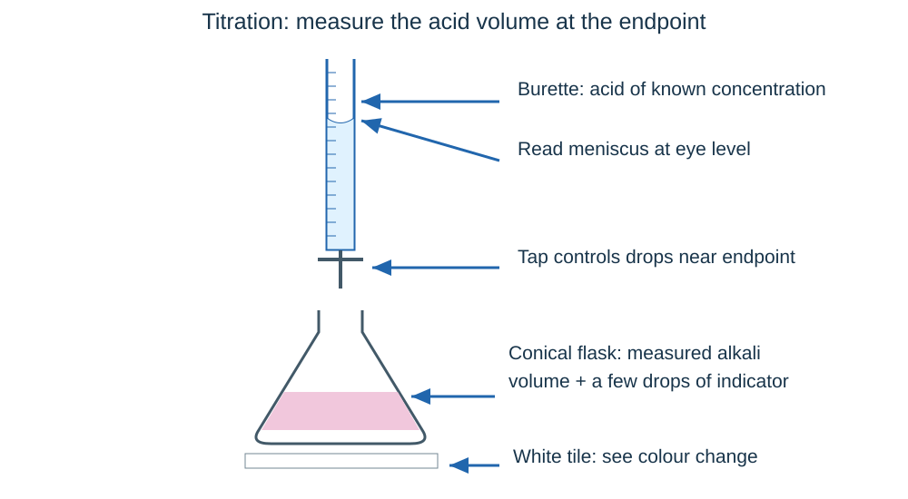
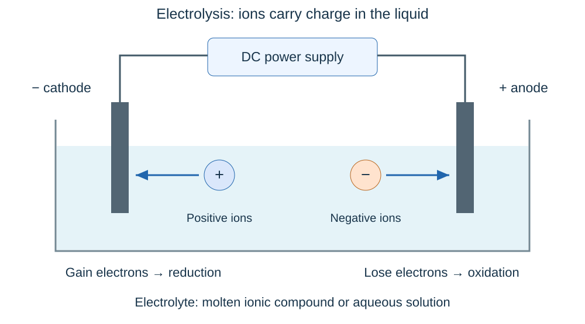

# Chemical changes

## Reactivity and displacement

A reactive metal gives up electrons readily. Think of metals competing for a place in a compound: a more reactive metal can push a less reactive one out.

**Potassium > sodium > lithium > calcium > magnesium > aluminium > carbon > zinc > iron > hydrogen > copper > silver > gold.**

Carbon and hydrogen are comparison points, not metals. Aluminium has a protective oxide layer, so its surface can hide its high reactivity.

| Metal | With cold water | With dilute hydrochloric or sulfuric acid |
|---|---|---|
| Potassium, sodium, lithium | React readily; potassium most vigorous of these three | Too violent for a routine school test |
| Calcium | Reacts, producing hydrogen and calcium hydroxide | Very vigorous |
| Magnesium | Very slow with cold water | Rapid fizzing |
| Zinc | No significant reaction | Fizzes; slower than magnesium under comparable conditions |
| Iron | No significant reaction | Slower fizzing than zinc |
| Copper | No reaction | No reaction with these dilute acids |

- With water, the reactive metals above form a **metal hydroxide and hydrogen**. Example: **2Na + 2H₂O → 2NaOH + H₂**.
- Metals above hydrogen can displace it from dilute acid. **Mg + 2HCl → MgCl₂ + H₂**.
- Keep temperature, acid concentration, metal surface area and amount comparable when judging reaction vigour. Faster fizzing then suggests a more reactive metal.

### Displacement from a salt

**Zn + CuSO₄ → ZnSO₄ + Cu.** Zinc is more reactive, so it displaces copper. Copper metal forms and the blue solution fades as copper ions are removed.

Ionic equation: **Zn + Cu²⁺ → Zn²⁺ + Cu**. Sulfate ions are unchanged **spectator ions**, so they are omitted.

If A displaces B but C displaces A, the order is **C > A > B**. Use several results, not just a single observation.

## Oxidation, reduction and extraction

| Description | Oxidation | Reduction |
|---|---|---|
| Oxygen | Gain of oxygen | Loss of oxygen |
| Electrons | **Loss of electrons** | **Gain of electrons** |

Remember **OIL RIG**: Oxidation Is Loss; Reduction Is Gain. These electron changes happen together in a **redox reaction**.

In zinc displacing copper:

- **Zn → Zn²⁺ + 2e⁻**: zinc is oxidised.
- **Cu²⁺ + 2e⁻ → Cu**: copper ions are reduced.

In magnesium reacting with acid, magnesium loses electrons; **2H⁺ + 2e⁻ → H₂** shows hydrogen ions gaining them. Do not say the chloride ions are reduced: they remain spectators.

### Extracting a metal

- Very unreactive metals such as gold may be found as the **element**.
- Most metals occur in compounds and need a chemical reaction for extraction.
- A metal **less reactive than carbon** can be extracted from its oxide using carbon. **2CuO + C → 2Cu + CO₂**: copper oxide loses oxygen; carbon gains oxygen.
- More reactive metals, such as aluminium, need **electrolysis** of molten compounds. Electrolysis can also be used when reaction with carbon would cause a problem.
- Electrolysis requires energy to melt the material and supply current, so it is often expensive.

## Acids, alkalis and pH

An acid forms **H⁺ ions in aqueous solution**. An alkali is a soluble base and supplies **OH⁻ ions** in water.

- pH **below 7**: acidic. pH **7**: neutral. pH **above 7**: alkaline, on the usual 0–14 scale.
- **Universal indicator** gives an approximate pH by colour comparison. A calibrated **pH probe** provides a numerical measurement.
- Acid + alkali → salt + water.
- The key ionic equation is **H⁺(aq) + OH⁻(aq) → H₂O(l)**.

Neutralisation is like matching pairs: hydrogen ions and hydroxide ions combine. The other ions remain in solution as the salt. Equal volumes do not necessarily neutralise each other: concentration and equation ratio matter.

### Strong is different from concentrated

| Term | Meaning |
|---|---|
| **Strong acid** | Completely ionised in water; hydrochloric, nitric and sulfuric acids |
| **Weak acid** | Partially ionised in water; ethanoic, citric and carbonic acids |
| **Concentrated** | Large amount of dissolved acid per unit volume of solution |
| **Dilute** | Small amount per unit volume |

A strong acid can be dilute; a weak acid can be concentrated. Strength describes the **proportion ionised**, not how much acid was added.

For comparable solutions at the same concentration, the stronger acid produces more H⁺ and has a **lower pH**. Every decrease of one pH unit means **10 times greater H⁺ concentration**: pH 2 has **100 times** the H⁺ concentration of pH 4. A lower pH number means greater acidity.

## Acid reactions and salt names

| Acid reacts with | Products | Example |
|---|---|---|
| Suitable metal | Salt + hydrogen | Zn + H₂SO₄ → ZnSO₄ + H₂ |
| Metal oxide or hydroxide | Salt + water | CuO + H₂SO₄ → CuSO₄ + H₂O |
| Metal carbonate | Salt + water + carbon dioxide | CuCO₃ + H₂SO₄ → CuSO₄ + H₂O + CO₂ |

- Hydrochloric acid → **chlorides**.
- Sulfuric acid → **sulfates**.
- Nitric acid → **nitrates**.
- The metal supplies the positive ion and the first part of the salt name.

Balance ion charges when writing formulae: Mg²⁺ needs two NO₃⁻ ions → **Mg(NO₃)₂**. Two Na⁺ balance SO₄²⁻ → **Na₂SO₄**.

Hydrogen gives a **squeaky pop** with a lit splint. Carbon dioxide turns **limewater cloudy**. Test a small collected gas sample using the instructed method, away from the main reaction.

## Required practical: pure dry salt crystals

To make **copper sulfate** from dilute sulfuric acid and insoluble copper oxide:

1. Wear eye protection. **Gently warm the dilute acid** using the specified apparatus; do not boil it. Turn off the burner before adding solid.
2. Add copper oxide a little at a time and stir. Continue until **some solid remains and no more reacts**: the oxide is in excess, so all acid has reacted.
3. **Filter** to remove excess copper oxide. Copper sulfate solution is the **filtrate**, not the residue.
4. Gently evaporate some water using a **water bath or electric heater**, producing a concentrated solution.
5. Leave to **cool and crystallise**.
6. Filter the crystals, rinse with a little cold distilled water, and **dry between filter papers**.

The same approach works for suitable insoluble carbonates, with fizzing as carbon dioxide is released. Adding excess solid ensures complete acid reaction; filtration makes the solution free of that solid. Do not strongly heat to complete dryness: crystals may lose water or decompose.

For a soluble alkali, filtration cannot remove the excess. Use **titration** to find exactly the reacting volumes instead.

## Required practical: titration

A titration measures the volume needed for an acid and alkali to react exactly.

1. Rinse a **volumetric pipette with the alkali**, then use a pipette filler to place a fixed volume, such as 25.0 cm³, in a conical flask.
2. Add a few drops of a suitable indicator, such as **phenolphthalein or methyl orange**. Place the flask on a white tile.
3. Rinse the **burette with the acid**, fill it, and ensure the jet contains solution with no air bubble. Remove the filling funnel.
4. Read the bottom of the meniscus at **eye level** and record the initial reading. It need not be zero.
5. Add acid while swirling. Near the endpoint, add **drop by drop** until the first permanent indicator change. Rinse splashes down the flask with distilled water if needed.
6. Record the final reading. **Titre = final − initial burette reading**.
7. Do a rough trial, then repeat accurately until **concordant titres** are obtained. Calculate the mean of concordant accurate results, following any stated tolerance.

Adding acid to alkali: phenolphthalein changes **pink to colourless**; methyl orange changes **yellow towards orange at the endpoint**. Universal indicator has a broad colour range, so it is less suitable for a sharp endpoint.

A flask may be rinsed with distilled water because added water does not change its moles of alkali. Water left in a burette would dilute the acid and change its concentration. Wear goggles; use a pipette filler, never mouth-pipette.

### Turn a titre into concentration

**HCl + NaOH → NaCl + H₂O.** Suppose 20.0 cm³ of 0.100 mol/dm³ HCl neutralises 25.0 cm³ NaOH.

- HCl moles = 0.100 × 0.0200 = **0.00200 mol**.
- Ratio 1 : 1 gives **0.00200 mol NaOH**.
- NaOH concentration = 0.00200 ÷ 0.0250 = **0.0800 mol/dm³**.
- Mᵣ NaOH = 40, so mass concentration = 0.0800 × 40 = **3.20 g/dm³**.

For pure sodium chloride crystals, repeat using the exact acid and alkali volumes **without indicator**, then concentrate and crystallise. Check the balanced equation: sulfuric acid needs a different ratio.

## Electrolysis and electrode reactions

**Electrolysis uses an electric current to break down an ionic compound.** The electrolyte must be **molten or dissolved** so its ions can move. A solid ionic lattice cannot conduct because its ions are fixed.

| Electrode during electrolysis | Attracts | Electron change |
|---|---|---|
| **Cathode, negative** | Positive ions | Gain electrons: **reduction** |
| **Anode, positive** | Negative ions | Lose electrons: **oxidation** |

Electrons move through the external wires; **ions carry charge through the electrolyte**. The power supply drives the process. Check both the atom count and total charge when balancing a half-equation.

### Molten compounds

A molten binary compound contains only the ions from that compound. With inert electrodes, the metal forms at the cathode and the non-metal at the anode.

For molten lead bromide:

- Cathode: **Pb²⁺ + 2e⁻ → Pb**.
- Anode: **2Br⁻ → Br₂ + 2e⁻**.
- Overall: **PbBr₂ → Pb + Br₂**.

This is a theoretical example; lead compounds and bromine require particular precautions. Follow the school’s safer practical choice rather than attempting it independently.

## Aqueous electrolysis

Water introduces **H⁺ and OH⁻ ions**, so there are competing products. For a solution of one ionic compound using **inert electrodes**:

- **Cathode:** if the metal is more reactive than hydrogen, **hydrogen** forms. Otherwise the metal forms.
- **Anode:** a **halogen** forms if halide ions are present; otherwise **oxygen** forms.

| Solution | Cathode | Anode |
|---|---|---|
| Sodium chloride | Hydrogen | Chlorine |
| Copper chloride | Copper | Chlorine |
| Sodium sulfate | Hydrogen | Oxygen |
| Copper sulfate | Copper | Oxygen |

Useful half-equations:

- **2H⁺ + 2e⁻ → H₂**.
- **Cu²⁺ + 2e⁻ → Cu**.
- **2Cl⁻ → Cl₂ + 2e⁻**.
- **4OH⁻ → O₂ + 2H₂O + 4e⁻**.

Do not produce sodium metal from sodium chloride **solution**: hydrogen forms instead. Molten sodium chloride gives sodium and chlorine. The molten/aqueous distinction changes the answer.

## Required practical: aqueous electrolysis

Investigate the hypothesis: **changing the dissolved ionic compound changes the electrode products**.

1. Use a low-voltage DC supply and two **inert graphite electrodes**, held apart in the solution.
2. Identify positive and negative connections. Keep electrodes apart to avoid a short circuit.
3. Switch on and record bubbles, deposits and colour changes at each electrode.
4. Collect enough gas for appropriate tests, keeping samples separate. **Hydrogen: squeaky pop; oxygen: relights a glowing splint; chlorine: bleaches damp litmus paper**. Do not smell gases directly.
5. Compare solutions, keeping concentration, volume, voltage, electrode area/separation and duration the same. Rinse electrodes between solutions or use clean replacements.
6. Repeat observations. Compare the results with predictions from the ions present and the product rules.

Wear goggles. Chlorine is harmful: use the teacher’s ventilation and small-scale procedure, and switch off before adjusting the apparatus. Dispose of metal-containing solutions as instructed.

A brown copper coating at a cathode indicates **Cu²⁺ reduction**, not a gas. A negative result needs enough reaction time and a working circuit before concluding that a product is absent.

## Extracting aluminium

Aluminium is above carbon in the reactivity series, so carbon cannot remove oxygen from aluminium oxide effectively.

- Aluminium oxide is dissolved in **molten cryolite**, lowering the operating temperature compared with pure aluminium oxide and reducing heating costs.
- Cathode: **Al³⁺ + 3e⁻ → Al**. Aluminium ions are **reduced**.
- Anode: **2O²⁻ → O₂ + 4e⁻**. Oxide ions are **oxidised**.
- Oxygen reacts with the **carbon anodes**, forming carbon dioxide. The anodes wear away and must be replaced.
- Electricity is still needed to drive electrolysis; cryolite reduces the heating requirement, not the need for current.
