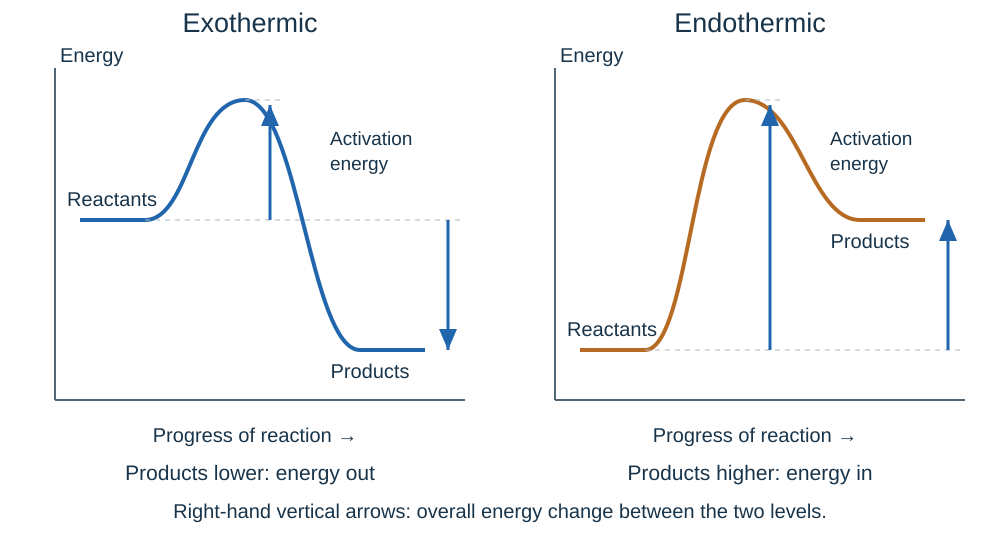

# Energy changes questions & answers

## 1 mark

**1.** A reaction warms the surrounding solution. Is it exothermic or endothermic?

**Answer:** Exothermic.

**2.** Name the type of reaction that takes energy from its surroundings.

**Answer:** Endothermic.

**3.** What name is given to the minimum energy that particles need to react when they collide?

**Answer:** Activation energy.

**4.** Are ordinary alkaline cells rechargeable or non-rechargeable?

**Answer:** Non-rechargeable.

**5.** Four 1.5 V cells are connected in series in the same direction. What is the total voltage?

**Answer:** 6.0 V.

**6.** What is the overall chemical product of a hydrogen fuel cell?

**Answer:** Water.

## 2 marks

**7.** Explain why the surroundings become colder during an endothermic reaction.

**Answer:**

- Energy is **transferred from the surroundings to the reacting chemicals**.
- The surroundings lose thermal energy, so their temperature falls.

**8.** State the energy changes associated with breaking and forming chemical bonds.

**Answer:**

- **Breaking bonds takes in energy**.
- **Forming bonds releases energy**.

**9.** An exothermic reaction transfers energy to the surroundings. Explain why this does not break the law of conservation of energy.

**Answer:**

- The products have **less energy than the reactants**.
- The decrease equals the energy transferred to the surroundings; energy is **transferred, not created**.

**10.** Why is a polystyrene cup with a lid useful for measuring temperature changes?

**Answer:**

- It **reduces energy transfer between the mixture and the surroundings**.
- The measured temperature change is therefore closer to that caused by the reaction.

**11.** A solution changes from 22.4 °C to 17.1 °C. Calculate the temperature change and classify the process.

**Answer:**

- Change = 17.1 − 22.4 = **−5.3 °C**.
- **Endothermic**, because the surrounding solution cools.

**12.** Explain how a rechargeable cell is restored for further use.

**Answer:**

- An **external electrical current** is supplied.
- This **reverses the chemical reactions**, restoring reactants.

**13.** State two factors that affect the voltage produced by a chemical cell.

**Answer:**

- The **electrode materials**.
- The **electrolyte used**.

**14.** Give one exothermic reaction and one endothermic reaction.

**Answer:**

- Combustion is **exothermic**.
- Thermal decomposition is **endothermic**.

## 3 marks

**15.** On an energy profile, reactants are at 70 kJ, the peak is at 160 kJ and products are at 30 kJ, using the same reference scale. Calculate activation energy and overall energy change, then classify the reaction.

**Answer:**

- Activation energy = 160 − 70 = **90 kJ**.
- Overall change = 30 − 70 = **−40 kJ**.
- **Exothermic**, because the products are lower in energy.

**16.** For CH₄ + 2O₂ → CO₂ + 2H₂O, state the numbers and types of bonds broken and formed.

**Answer:**

- Break **four C–H bonds and two O=O bonds**.
- Form **two C=O bonds** in carbon dioxide.
- Form **four O–H bonds** across the two water molecules.

**17.** Calculate the energy change for H₂ + Cl₂ → 2HCl. Bond energies: H–H 436, Cl–Cl 243, H–Cl 431 kJ/mol.

**Answer:**

- Bonds broken: 436 + 243 = **679 kJ**.
- Bonds formed: 2 × 431 = **862 kJ**.
- Change = 679 − 862 = **−183 kJ** for the molar quantities in the equation.

**18.** A best-fit line on a highest-temperature versus solid-mass graph passes through (0.50 g, 24.0 °C) and (2.00 g, 36.0 °C). Calculate its gradient and state the unit.

**Answer:**

- Temperature difference = 36.0 − 24.0 = **12.0 °C**.
- Mass difference = 2.00 − 0.50 = **1.50 g**.
- Gradient = 12.0/1.50 = **8.0 °C/g**.

**19.** A student changes the test metal electrode while measuring cell voltage. State three conditions to control: one for the electrolyte, one for temperature and one for the reference electrode.

**Answer:**

- Keep the **electrolyte type and concentration** the same.
- Keep the **electrolyte temperature** the same.
- Use the **same reference electrode and lead connections** throughout.

**20.** With a fixed copper reference and lead convention, a more positive reading means the test metal is more reactive than copper. Metals A, B and C give +1.2 V, +0.4 V and −0.2 V. Order A, B, C and copper by reactivity and explain.

**Answer:**

- **A > B > copper > C**.
- A and B are more reactive than copper; A has the larger positive reading under the stated convention.
- C has reversed polarity and is **less reactive than copper**.

**21.** Give the balanced overall equation for a hydrogen fuel cell and identify what is oxidised and reduced.

**Answer:**

- **2H₂ + O₂ → 2H₂O**.
- Hydrogen is **oxidised**, losing electrons.
- Oxygen is **reduced**, gaining electrons.

**22.** Balance this alkaline fuel-cell half-equation: O₂ + __H₂O + __e⁻ → __OH⁻. Explain whether it is oxidation or reduction.

**Answer:**

- **O₂ + 2H₂O + 4e⁻ → 4OH⁻**.
- Four electrons are gained, so it is **reduction**.
- Both sides contain four O atoms and four H atoms and have total charge −4.

## 4 marks

**23.** For H₂ + Br₂ → 2HBr, the energy change is −103 kJ for the molar quantities in the equation. H–H bond energy is 436 and Br–Br is 193 kJ/mol. Calculate H–Br bond energy.

**Answer:**

- Energy to break reactant bonds = 436 + 193 = **629 kJ**.
- Let H–Br bond energy = x; two bonds form, releasing **2x**.
- 629 − 2x = −103, so 2x = 732.
- **x = 366 kJ/mol**.

**24.** Draw an exothermic reaction profile. Label the axes, reactants, products, activation energy and overall energy change.

**Answer:**

- Vertical axis: **energy**; horizontal: **progress of reaction**.
- Products are **lower than reactants**, joined by a curved peak.
- Activation energy runs **from reactant level to the peak**.
- Overall change runs **between reactant and product levels**. The left-hand profile below shows this.

**25.** Calculate the energy change for CH₄ + 2O₂ → CO₂ + 2H₂O and explain its sign. Bond energies in kJ/mol: C–H 413, O=O 498, C=O 805, O–H 464.

**Answer:**

- Breaking: (4 × 413) + (2 × 498) = **2,648 kJ**.
- Forming: (2 × 805) + (4 × 464) = **3,466 kJ**.
- Change = 2,648 − 3,466 = **−818 kJ** for the molar equation quantities.
- It is **exothermic**: forming bonds releases more energy than breaking bonds requires.

**26.** A student uses an uninsulated beaker, does not stir and takes only one temperature reading long after mixing. Suggest improvements and explain why they help.

**Answer:**

- Use an **insulated cup and lid** to reduce energy transfer to the surroundings.
- **Stir consistently** to make mixture temperature more uniform.
- Record promptly at regular intervals to detect the **maximum or minimum**, rather than missing it.
- Repeat and average to reduce the effect of random variation, keeping the starting conditions the same.

**27.** Write both acidic hydrogen fuel-cell half-equations, using four electrons in each, and show how they give the overall equation.

**Answer:**

- Oxidation: **2H₂ → 4H⁺ + 4e⁻**.
- Reduction: **O₂ + 4H⁺ + 4e⁻ → 2H₂O**.
- Add and **cancel 4H⁺ and 4e⁻** from both sides.
- Overall: **2H₂ + O₂ → 2H₂O**.

## 6 marks

**28.** Plan an investigation into how hydrochloric acid concentration affects the temperature change when reacting with sodium hydroxide. Include controls and how you would use the results.

**Answer:**

- Predict that greater acid concentration increases the rise while acid limits the reaction. Wear goggles and use appropriate dilute solutions.
- Place an insulated cup in a supporting beaker with a lid and thermometer. Measure fixed volumes of acid and alkali; start both at the same temperature.
- Record initial temperature, mix and stir consistently; record at regular intervals to find the maximum. Calculate **maximum − initial temperature**.
- Repeat with several acid concentrations, using fresh solutions. Control volumes, alkali concentration, starting temperature, apparatus and timing.
- Repeat each condition, investigate anomalies and calculate means. Plot acid concentration against temperature rise.
- Explain a possible plateau: once **alkali becomes limiting**, more acid cannot cause more neutralisation. Discuss heat loss as a limitation.

**29.** Evaluate a hydrogen fuel cell and a rechargeable battery for powering a vehicle. Consider how each supplies energy and the environmental effects over its life.

**Answer:**

- A fuel cell needs a continuous external supply of hydrogen and oxygen; it generates electricity and water through **hydrogen oxidation**. Refuelling may be quick, but storage tanks and supply infrastructure are needed.
- A rechargeable battery stores its reacting chemicals internally; supplying current **reverses its reactions**. It can use charging infrastructure, but charging time and battery mass matter.
- Neither produces direct CO₂ exhaust during electrical operation; a hydrogen fuel cell produces water.
- Overall emissions depend on **how hydrogen and charging electricity are produced**, so water at the outlet does not prove zero lifetime emissions.
- Compare efficiency, cost, useful life, materials, recycling and hydrogen storage/flammability as well as driving requirements.
- Choose using the supplied evidence and intended use: access to low-carbon energy, refuelling or charging facilities and acceptable mass/time can change the best option.

## Past-paper sources

These are original practice questions, informed by the AQA papers below and the current course specification. The answers are tutor-written; the linked mark schemes show the official answers to the original papers.

### Resource directory

- [AQA assessment resources](https://www.aqa.org.uk/subjects/chemistry/gcse/chemistry-8462/assessment-resources) — official papers and mark schemes.
- [Physics & Maths Tutor](https://www.physicsandmathstutor.com/past-papers/gcse-chemistry/aqa-paper-1/) — paper archive.
- [Revision Science](https://revisionscience.com/gcse-revision/chemistry/chemistry-gcse-past-papers/aqa-gcse-chemistry-past-papers) — alternative archive.

### Papers used

- June 2019, Paper 1 Higher: [question paper](../../00 - Past papers/Paper 1 Higher/AQA-84621H-QP-JUN19.pdf) · [mark scheme](../../00 - Past papers/Paper 1 Higher/AQA-84621H-MS-JUN19.pdf).

- June 2022, Paper 1 Higher: [question paper](../../00 - Past papers/Paper 1 Higher/AQA-84621H-QP-JUN22.pdf) · [mark scheme](../../00 - Past papers/Paper 1 Higher/AQA-84621H-MS-JUN22.pdf).

- June 2023, Paper 1 Higher: [question paper](../../00 - Past papers/Paper 1 Higher/AQA-84621H-QP-JUN23.pdf) · [mark scheme](../../00 - Past papers/Paper 1 Higher/AQA-84621H-MS-JUN23.pdf).

### Question types checked

- Temperature investigations and data: 2019 Q09.1–09.4; 2022 Q02.1–02.4; 2023 Q02.1–02.6.
- Reaction profiles: 2019 Q05.7; 2022 Q02.5–02.6; 2023 Q04.3.
- Bond energies: 2019 Q05.5–05.6; 2023 Q04.1–04.2.
- Cells and fuel cells: 2019 Q06.1–06.4; 2022 Q04.7 (cell setup).

These are themes evidenced in the sampled papers, not predictions of a future paper. Additional practice includes fuel-cell half-equations and evaluation required by the current specification. Questions, data and allocations are original.

Additional questions cover the rest of this topic, including practical and mathematical skills. This is a revision selection, not a prediction of the next exam.
