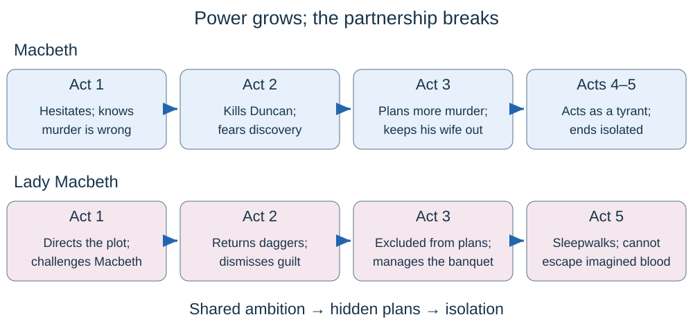

# Macbeth

## The story in five acts

Macbeth is a successful soldier who murders his king to gain the crown. Once he has power, he becomes afraid of losing it and commits more violence. **His attempt to control the future destroys his security, relationships and life.**

Imagine cheating to win a competition, then having to tell a new lie every time someone gets close to the truth. Macbeth's first crime starts a chain of concealment and fear. The consequences grow far beyond him, damaging Scotland itself.

| Act | Main events | Why it matters |
|---|---|---|
| **1: temptation and choice** | Witches predict Macbeth's rise; he becomes Thane of Cawdor. Duncan names Malcolm his heir. Lady Macbeth urges Macbeth to kill Duncan. | The prophecy tempts Macbeth, but he recognises the moral objections and chooses murder. |
| **2: murder and disorder** | Macbeth kills Duncan offstage. Lady Macbeth returns the daggers. Macduff discovers the body. Malcolm and Donalbain flee; Macbeth becomes king. | The crown is gained through betrayal. Blood, sleeplessness and unnatural events reveal the cost. |
| **3: fear and isolation** | Macbeth arranges Banquo and Fleance's murders. Banquo dies; Fleance escapes. Macbeth sees Banquo's ghost at a banquet. | Killing Duncan does not bring safety. Private guilt disrupts public kingship. |
| **4: false confidence and cruelty** | Apparitions give misleading assurances. Macbeth orders an attack on Macduff's family. In England, Malcolm tests Macduff before joining him. | Macbeth moves from fearful hesitation to impulsive tyranny. The victims' suffering becomes visible. |
| **5: collapse and resistance** | Lady Macbeth sleepwalks and later dies. Soldiers carry branches from Birnam Wood. Macduff reveals his unusual birth and kills Macbeth. Malcolm takes power. | The apparent guarantees fail. Order returns, but the human losses remain. |

**Key distinction:** the witches predict; Macbeth decides. They do not command him to murder Duncan.

## Macbeth: from defender to tyrant

Macbeth is interesting because he is not simply evil from the beginning. Shakespeare lets us hear the gap between his **public reputation** and **private desires**.

- **Respected warrior, 1.2:** the Captain calls him “brave Macbeth”. His violence is initially praised because it protects Duncan. The same ability later threatens Scotland.
- **Secret ambition, 1.4:** “Stars, hide your fires” asks the heavens to conceal his wishes. Darkness becomes a way of hiding moral knowledge, not just a setting.
- **Conscience before murder, 1.7:** he knows he is Duncan's relative, subject and host. “Vaulting ambition” suggests a rider who leaps too far and falls. He recognises that desire outruns judgement.
- **Fear after murder, 2.2:** blood and imagined voices make guilt feel physical. Killing a sleeping guest destroys his own peace.
- **Insecurity as king, 3.1–3.4:** he fears Banquo's descendants and arranges murder without consulting his wife. His authority is undermined publicly when he confronts the ghost.
- **Tyranny, 4.1–4.2:** ordering the deaths of Macduff's family attacks vulnerable people rather than military opponents.
- **Emptiness and defiance, 5.5–5.8:** “Life's but a walking shadow” suggests that power has lost its meaning. He still fights, but courage does not erase responsibility.

A useful argument: **Macbeth gains political power while losing control of himself.** An audience may feel pity for his wasted potential while condemning his choices.

## Lady Macbeth and the marriage

Lady Macbeth initially appears more decisive than her husband. However, her commands can also reveal how hard she must work to suppress compassion.

- **1.5:** “unsex me here” asks the spirits to remove qualities she associates with feminine tenderness. The imperative sounds forceful, but the request implies she does not naturally possess all the cruelty she wants.
- **1.7:** she questions Macbeth's masculinity and links murder to proving himself a man. Her shocking example of harming a nursing baby presents commitment as more important than care.
- **2.2:** she manages the immediate crisis, returns the daggers and claims “A little water clears us of this deed”. Yet she admits Duncan resembled her father, exposing an emotional limit.
- **3.2:** “Naught's had, all's spent” reveals that becoming queen has brought no satisfaction. Macbeth keeps the Banquo plot from her.
- **3.4:** she protects his public image at the banquet, explaining his behaviour to the guests while privately challenging him.
- **5.1:** repeated hand-rubbing and broken speech expose the guilt she once dismissed. “Out, damned spot” cannot remove an imagined stain.
- **5.5 and the ending:** her death is reported, not staged. Malcolm later reports that she is thought to have taken her own life; the audience does not witness exactly what happened.

The marriage moves from **shared plans → divided knowledge → emotional isolation**. Do not reduce Lady Macbeth to a person who simply controls Macbeth throughout the play: he becomes an independent organiser of violence.

## Banquo, Macduff and the rulers

| Character | Main purpose | Evidence and interpretation |
|---|---|---|
| **Banquo** | A contrast, or **foil**, to Macbeth | Both hear prophecies. Banquo warns about “instruments of darkness” (1.3), showing suspicion rather than immediate surrender. Yet he is interested in the promised future of his descendants. |
| **Fleance** | A future Macbeth cannot control | His escape means killing Banquo has not removed the threat to Macbeth's dynasty. The play does not show Fleance becoming king. |
| **Macduff** | Resistance and the human cost of tyranny | He discovers Duncan's murder, seeks help for Scotland and grieves for his family. “I must also feel it as a man” (4.3) challenges the idea that masculinity excludes emotion. |
| **Lady Macduff and her son** | Innocent victims | Their domestic conversation and onstage danger expose how political violence destroys ordinary family life. Lady Macduff also questions her husband's departure. |
| **Duncan** | Legitimate authority, but vulnerable judgement | He rewards loyalty but misjudges both the old Thane of Cawdor and Macbeth. His trusting arrival makes the betrayal more disturbing. |
| **Malcolm** | A possible restoration of responsible rule | He tests Macduff's loyalty in 4.3 and contrasts a ruler's duties with Macbeth's self-interest. His final order offers a fresh start after damage. |
| **The witches** | Temptation and uncertainty | Their paradoxes and double meanings encourage Macbeth to hear what he wants. Their power over events can be debated; his moral choices remain visible. |

**A foil is not an exact opposite in every way.** Banquo shares curiosity about the future; Macduff's political duty creates a painful conflict with his duty to his family.

## Ambition, power and kingship

The play questions **how power is gained and what it is used for**.

1. Macbeth begins by protecting a king and is rewarded for loyalty.
2. His desire for the crown overcomes his knowledge of duty.
3. Once crowned, he treats other people as threats to his survival.
4. Scotland suffers under a ruler concerned with himself.
5. Malcolm's restoration suggests that legitimate leadership should serve the country.

“Upon my head they placed a fruitless crown” (3.1) turns kingship into an image of infertility: Macbeth has power but fears he cannot pass it on. The crown produces anxiety instead of fulfilment.

**Violence changes its purpose:** defence of Scotland becomes murder of a guest, then political assassination, then slaughter of a family. Track that escalation instead of listing murders without explanation.

## Guilt, blood and sleep

A **motif** is a repeated image or idea whose meaning develops.

| Motif | Early meaning | Later development |
|---|---|---|
| **Blood** | Evidence of military bravery | Evidence of murder, then an imagined permanent moral stain |
| **Sleep** | Innocence, rest and vulnerability | Macbeth fears he has destroyed sleep; Lady Macbeth's sleepwalking exposes distress |
| **Washing** | Lady Macbeth's practical way to hide the crime | Her imagined stain cannot be washed away |

Macbeth asks whether “all great Neptune's ocean” can clean his hand (2.2). The **hyperbole** makes guilt larger than the natural world. His next thought reverses the image: his blood could make the sea red. The stain seems able to contaminate everything around it.

The contrast with Lady Macbeth's “little water” is crucial. In Act 2 she minimises the problem; in Act 5 her body acts out the guilt she can no longer contain. **The repeated action changes meaning across the play.**

## Appearance, deception and the supernatural

“Fair is foul, and foul is fair” (1.1) joins opposites, unsettling the audience's trust in appearances.

- Lady Macbeth tells her husband to resemble an “innocent flower” while being a “serpent” underneath (1.5). The image separates a harmless surface from hidden danger.
- Duncan feels safe at Macbeth's castle, while the audience knows the murder plan. This is **dramatic irony**: the audience knows what a character does not.
- At the banquet, Macbeth tries to perform secure kingship but his reactions to the ghost reveal instability.
- The apparitions' promises are **equivocal**: they can be technically fulfilled in a way Macbeth does not expect.

**Birnam Wood** appears to move because soldiers use branches as camouflage. **Macduff** was delivered by being cut from his mother's womb, defeating Macbeth's interpretation of the prophecy about birth. Macbeth mistakes partial information for complete protection.

Hallucination and the supernatural are not always identical. Macbeth's dagger vision can be read as an outward sign of his murderous intention and fear. Banquo's ghost may be staged to emphasise supernatural punishment, psychological guilt, or both. Explain the reading through what an audience sees and hears.

## Gender, courage and vulnerability

Characters argue about what it means to be a man.

- Lady Macbeth treats courage as willingness to carry out murder.
- Macbeth first argues that there are moral limits to manhood: “I dare do all that may become a man” (1.7).
- Later he manipulates the murderers through similar challenges to their masculinity.
- Macduff insists that feeling grief is part of being a man (4.3), offering a different model of courage.

The play therefore gives **competing definitions of masculinity**, rather than one simple message that men are violent and women are weak. Lady Macbeth's early influence also complicates expectations of obedience within marriage.

The Scottish setting and the early seventeenth-century stage audience are different contexts. Beliefs about monarchy, witchcraft and gender can clarify a moment, but avoid claims that every person in Shakespeare's audience thought the same thing. Keep the argument grounded in the play.

## How Shakespeare makes the drama work

| Method | Meaning | Useful example and effect |
|---|---|---|
| **Soliloquy** | A speech presenting a character's private thoughts | Macbeth weighs murder in 1.7; the audience sees his knowledge and responsibility |
| **Aside** | Words shared with the audience but not other characters onstage | Macbeth's private reaction to the prophecy reveals thoughts he hides from others |
| **Dramatic irony** | Audience knows more than a character | Duncan's confidence in his hosts makes the coming betrayal tense |
| **Contrast** | Placing differences together | Macbeth and Banquo respond differently to the same prediction |
| **Imagery and metaphor** | Describing one thing through another | Clothing can suggest a role that does not fit; blood makes guilt visible |
| **Verse and prose** | Different speech patterns | Lady Macbeth's fragmented sleepwalking prose contrasts with her earlier controlled speeches |
| **Rhythm and rhyme** | Patterned sound | The witches' chants and recurring rhymes can sound ritual-like and separate them from ordinary conversation |
| **Stage action and sound** | What an audience sees and hears | Knocking after Duncan's murder interrupts private horror with the threat of discovery |

Much of the play uses **blank verse**, usually unrhymed iambic pentameter. Do not claim every line is perfectly regular or that prose always means madness: explain the particular passage.

Duncan's murder happens **offstage**, focusing attention on anticipation and aftermath. The attack on Macduff's family is brought onto the stage, confronting the audience with innocent suffering. Those choices are part of **dramatic structure**, not merely plot information.

## A small quotation bank with many uses

| Evidence | Speaker and location | Flexible uses |
|---|---|---|
| “brave Macbeth” | Captain, 1.2 | Reputation; violence; tragic change |
| “instruments of darkness” | Banquo, 1.3 | Temptation; caution; contrast |
| “Stars, hide your fires” | Macbeth, 1.4 | Secret desire; darkness; conscience |
| “unsex me here” | Lady Macbeth, 1.5 | Gender; ambition; suppression of compassion |
| “innocent flower” / “serpent” | Lady Macbeth, 1.5 | Deception; appearance and reality |
| “vaulting ambition” | Macbeth, 1.7 | Self-knowledge; excess; downfall |
| “Macbeth does murder sleep” | Macbeth reporting a voice, 2.2 | Guilt; innocence; psychological damage |
| “A little water clears us of this deed” | Lady Macbeth, 2.2 | Concealment; dramatic reversal; guilt |
| “fruitless crown” | Macbeth, 3.1 | Insecurity; inheritance; empty power |
| “full of scorpions is my mind” | Macbeth, 3.2 | Anxiety; violent thoughts; loss of peace |
| “I must also feel it as a man” | Macduff, 4.3 | Grief; masculinity; humane resistance |
| “Out, damned spot” | Lady Macbeth, 5.1 | Guilt; failed control; religious fear |
| “Life's but a walking shadow” | Macbeth, 5.5 | Despair; emptiness; tragic ending |

Learn what each phrase **means in its moment**, then use it to develop an argument. A precise reference to an event can also support a point; do not invent quotation wording.

## Writing about an extract

The extract question is worth **15 marks**. Aim for about **20 minutes**. Stay close to the printed passage and its changes in mood, language and behaviour.

- Begin with a direct overview: what is happening emotionally or dramatically?
- Follow the passage through its main shifts; use evidence from different parts.
- Explain a specific word, image, action or speech pattern.
- Connect the choice to character, meaning and a possible **audience response**.
- Use enough context to locate the moment, without retelling the whole play.

**Point → evidence → close analysis → effect → question.** Treat this as a thinking route, not a compulsory sentence formula.

For example: Lady Macbeth's command **“Out, damned spot”** suggests that she tries to use the same forceful language that once directed her husband. Yet the stain is imagined, so the command achieves nothing. The word **“damned”** gives the mark a moral and religious weight. An audience may feel horror or pity at the gap between her earlier confidence and her present helplessness.

## Building a whole-play argument

The essay question is worth **25 marks: 20 for the literary response and 5 for spelling, punctuation, vocabulary and sentence control**. Aim for about **40 minutes**, including a short plan and final check.

1. Decide your answer to the exact question. For Lady Macbeth's change: **she moves from directing others to being unable to control herself**.
2. Choose three or four moments that develop the argument across the play.
3. Explain **how Shakespeare presents** the character or theme, not just what happens.
4. Link the stages: initially, however, increasingly, by the end.
5. Finish with the significance of the change, rather than a list of repeated points.

Write connected paragraphs in the exam. A useful paragraph does more than name a technique: it explains why that choice matters here. **An interpretation, evidence and a developed explanation** work together.

For Shakespeare, the assessed focus is your understanding, analysis and writing accuracy. Context can illuminate a reading, but a detached history paragraph takes space away from close analysis. Avoid diagnosing a character or stating Shakespeare's purpose as a proven fact when it is an interpretation.
