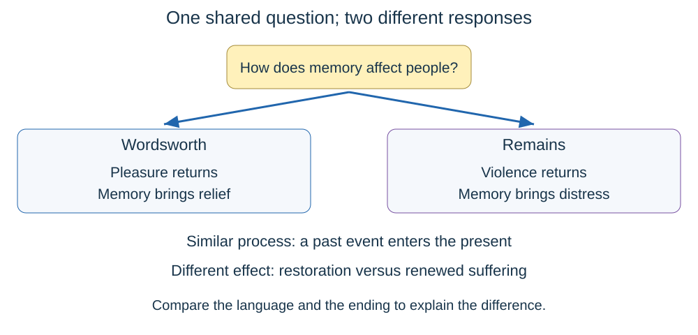

# Poetry anthology

## The Schoolboy — William Blake

A child loves the freedom of a summer morning but feels miserable at school. Imagine trying to make a bird sing by locking it in a small cage: the method destroys the joy it needs.

- **Main argument:** learning that relies on fear can damage a child's natural curiosity and future growth.
- **Journey:** joyful outdoor morning → unhappy classroom → caged-bird comparison → appeal to parents about damaged plants and future seasons.
- **“Cruel eye”** reduces the authority figure to a watchful, threatening gaze. The child feels controlled rather than encouraged.
- The **extended metaphor** of the caged bird makes freedom necessary for expression. A bird unable to sing becomes an image of a child unable to thrive.
- Buds and blossoms represent young lives. Their destruction raises a larger question: what happens to adulthood if childhood is damaged?
- **Form and structure:** six five-line stanzas, patterned rhyme and a songlike voice contrast with the experience of restriction. Repeated questions demand an answer from adults.
- **Context that helps:** Blake's concern with childhood and restrictive authority explains why the child's voice challenges accepted adult power. The poem attacks joyless, fearful schooling; it does not say that all learning is harmful.
- **Compare:** Blackberry Picking also uses nature to explore childhood, but disappointment comes through decay. Catrin shows a child's wish for freedom from a parent's viewpoint.

## I Wandered Lonely as a Cloud — William Wordsworth

A solitary walker sees daffodils. Later, remembering them brings pleasure. Nature works like a favourite photograph you can replay in your mind, even when the real scene is far away.

- **Main argument:** an ordinary encounter with nature can become a lasting inner resource.
- **Journey:** solitary wandering → lively company of flowers → delayed understanding → renewed happiness in recollection.
- **“Lonely as a cloud”** initially places the speaker apart from others. Calling the flowers a “crowd” and a “host” gives nature a social presence.
- Repeated **personification** makes the flowers dance. The final image transfers that movement to the speaker's heart: the scene has changed his emotional life.
- **“Inward eye”** means imagination or memory. The wealth gained is emotional, not money.
- **Form and structure:** four six-line stanzas with ABABCC rhyme. The final stanza shifts from the remembered walk to repeated experiences at home. Its closing couplet offers satisfaction.
- **Context that helps:** Romantic writers often valued nature, individual feeling and imagination. The poem is shaped by Wordsworth's Lake District experience and the recollection of a walk with Dorothy Wordsworth.
- **Compare:** I Shall Return also connects natural beauty with emotional restoration, but its return remains a hope. Blackberry Picking shows pleasure that cannot be preserved physically.
- **Must know:** solitude at the end is rewarding; it is not simply the same as loneliness at the beginning.

## Blackberry Picking — Seamus Heaney

Children collect berries enthusiastically, but their stored fruit rots. It is like trying to keep a perfect summer day in a box: wanting it to last does not stop time.

- **Main argument:** desire repeatedly meets the limits of nature. Growing older means recognising loss without necessarily stopping hope.
- **Journey:** ripening and first taste → urgent collecting → hoarding → disgust and disappointment → the pattern repeats each year.
- Rich **sensory imagery** makes the initial fruit attractive. Images of blood and watching eyes also make this pleasure slightly unsettling.
- The reference to **Bluebeard** gives the sticky hands a disturbing fairy-tale association. Pleasure is mixed with greed and unease.
- The verbs **“hoped”** and **“knew”** pull in different directions: emotional desire survives practical knowledge.
- **Form and structure:** a long first stanza builds the excitement; a shorter second stanza overturns it. Mostly pentameter lines and paired rhymes/half-rhymes give shape to a memory whose outcome remains disappointing.
- **Context that helps:** Heaney's rural childhood in Northern Ireland gives the containers, fields and cattle shed a concrete setting. The adult speaker looks back at a child's repeated experience.
- **Compare:** Wordsworth preserves happiness through memory; Heaney cannot preserve the berries themselves. The Schoolboy also links childhood with natural growth, but blames human restriction.
- **Must know:** the fruit's decay can suggest a wider loss of innocence, but start with what actually happens before developing that interpretation.

## Sonnet 29 — Elizabeth Barrett Browning

The speaker thinks intensely about an absent lover, then insists that being with the real person is better than imagining them. Think of vines hiding a tree: thoughts about somebody can grow so large that they obscure the person.

- **Main argument:** love seeks real presence, not a substitute made from fantasy.
- **Journey:** thoughts grow around the beloved → the speaker rejects thoughts as a replacement → commands the beloved to break through them → closeness makes thinking unnecessary.
- The **extended metaphor** makes thoughts the vines and the beloved the tree. Growth conveys energy and attraction, but also the danger of concealment.
- **“Renew thy presence”** is an urgent imperative. The speaker actively states what she wants.
- Violent movement as the imagined greenery falls gives the reunion force and release. Sensory references to seeing, hearing and breathing replace abstract thinking.
- **Form and structure:** a 14-line Petrarchan sonnet. The turn begins early with “Yet”, developing across the poem rather than waiting neatly for line nine. The ending reverses the opening claim about thinking.
- **Context that helps:** it belongs to Sonnets from the Portuguese, associated with Barrett Browning's love for Robert Browning. The confident female voice actively expresses desire within a traditional love-poem form.
- **Compare:** Dusting the Phone also explores absence, but ends without reassuring contact. I Shall Return uses a sonnet for longing directed towards a homeland.
- **Must know:** this is Barrett Browning's Sonnet 29, beginning “I think of thee!”, not Shakespeare's poem with the same number.

## Cousin Kate — Christina Rossetti

An abandoned woman addresses the cousin who married the lord who rejected her. She seems powerless, then reveals a son whom the wealthy household wants as an heir. It resembles somebody finally answering back after others have told the story for them.

- **Main argument:** status and public respectability do not reliably reveal love or moral worth.
- **Journey:** contented rural life → exploitation and rejection → anger at unequal judgement → declaration of loyalty → defiant pride in her child.
- **“Changed me like a glove”** compares the speaker to a disposable object. The lord's power lets him replace one woman with another.
- Repeated **direct address** to Kate makes the poem accusatory and personal. The reader hears one forceful account, not an impartial narrator.
- **“My shame, my pride”** brings society's condemnation into conflict with the mother's affection. The child creates a final reversal of apparent advantage.
- **Form and structure:** six eight-line stanzas with recurring rhyme. The balladlike storytelling leads towards the delayed revelation of the son, which forces readers to reassess power.
- **Context that helps:** Victorian class inequality, inheritance and sexual double standards explain the difference between the women's reputations. The wealthy man largely escapes the judgement applied to the unmarried mother.
- **Compare:** Origin Story also finds value in the child of a relationship that does not last. Kamikaze shows a community enforcing shame through exclusion.
- **Must know:** the speaker asserts that her love was truer than Kate's; treat this as her claim and explore how she persuades us.

## Catrin — Gillian Clarke

A mother recalls giving birth, then describes a later disagreement about her daughter's freedom. The relationship resembles a tug of war in which both people still want to stay connected.

- **Main argument:** love and conflict can coexist. Becoming a separate person does not erase the emotional bond.
- **Journey:** childbirth in a clinical room → struggle for physical separation → later argument about skating after dark.
- The **“Red rope of love”** evokes the umbilical cord and becomes a metaphor for continuing attachment. Red suggests both bodily pain and intense feeling.
- The clean, square hospital surroundings contrast with the mother's emotional, expressive experience. Geometric images make the conflict between order and intense feeling visible.
- Shared pronouns connect mother and daughter even as each seeks independence. Neither simply wins; their relationship changes them both.
- **Form and structure:** two unequal stanzas connect two moments years apart. Free verse and enjambment let the feelings move across line boundaries. The ending lands on an ordinary request, making the larger struggle recognisable.
- **Context that helps:** Clarke draws on motherhood and her relationship with her daughter. A woman's account of childbirth and family tension becomes a serious poetic subject.
- **Compare:** The Schoolboy presents restricted freedom through a child; Catrin lets us hear the protective adult too. Origin Story examines family bonds from the next generation's perspective.
- **Must know:** conflict here does not prove a lack of love.

## Dusting the Phone — Jackie Kay

A person waits anxiously for a lover to call and becomes absorbed by the telephone. Imagine repeatedly checking for a message until the device seems to control your whole day.

- **Main argument:** uncertainty can turn affection into dependence, fear and frustrated attempts at control.
- **Journey:** awareness of anxious imagining → disaster feared whether the phone rings or stays silent → imagined futures → service to the phone → anger without a workable threat.
- **“Sirens”** gives everyday communication an emergency sound. Both possible outcomes become alarming, so the speaker has no reassuring option.
- **Personification** gives the telephone power. Polishing and dressing for it turn waiting into a ritual, as though good service could earn the desired call.
- Lists of incompatible futures show imagination multiplying possibilities instead of settling uncertainty.
- **Form and structure:** free verse, recurring three-line stanzas and an isolated final line. Short sentences and questions interrupt longer thoughts. The ending deflates the attempted ultimatum.
- **Context that helps:** the domestic telephone is the centre of the scene; the poem explores modern intimacy through an ordinary communication device. Kay's writing often examines relationships and belonging. The poem does not specify the lover's gender.
- **Compare:** Sonnet 29 also replaces an absent person with intense thought, but imagines release through presence. Cousin Kate gives a rejected speaker a much more assertive final position.
- **Must know:** the comic exaggeration can make the speaker relatable without making the loneliness trivial.

## Drummer Hodge — Thomas Hardy

A young drummer is buried far from his English home. The strange land will permanently contain him. Think of a name placed in a landscape that the person never had time to understand.

- **Main argument:** war removes an ordinary young person from home; the poem gives lasting attention to a life treated hurriedly in death.
- **Journey:** hasty burial → unfamiliar country and stars → reminder of his Wessex origins → permanent incorporation into the foreign earth.
- **“Throw”** and **“Uncoffined”** make the burial sound abrupt and lacking ceremony. Naming Hodge resists reducing him to an anonymous casualty.
- Local words for landscape emphasise unfamiliarity. The distant constellations place one small life beneath an enormous sky.
- **“For ever”** gives permanence to his separation. Growing into a tree can suggest connection with nature, but it cannot undo the death.
- **Form and structure:** three six-line stanzas with alternating rhyme. Present burial, past origins and future transformation organise the poem's movement through time. Its regularity gives dignity to an undignified death.
- **Context that helps:** the poem responds to the Second Boer War in southern Africa. Hardy's Wessex connects Hodge to rural southern England; the poem focuses on an ordinary soldier rather than celebrating empire.
- **Compare:** Disabled also challenges glamorous ideas of war through a young person's loss. I Shall Return longs for home; Hodge cannot return.
- **Must know:** this is a Boer War poem, not a First World War poem.

## Disabled — Wilfred Owen

A young veteran compares his dependent present with the energetic life he had before war. It is like cutting between two versions of the same place: others still enjoy it, but his access to it has changed.

- **Main argument:** the promises surrounding recruitment contrast cruelly with injury, isolation and inadequate care afterwards.
- **Journey:** lonely waiting → memories of sport and attraction → enlistment motives → muted homecoming → an uncertain institutional future.
- **“Ghastly suit of grey”** makes the present colourless and deathlike. The lively colours of remembered evenings intensify the contrast.
- The comparison **“like some queer disease”** exposes how others recoil from him. The poem criticises that reaction; his disability does not make him less human.
- Football blood once brought admiration; wartime blood brings devastating loss. This reversal exposes the difference between imagined and actual danger.
- **Form and structure:** shifts between past and present keep interrupting the account. Uneven stanza lengths and the repeated final question leave him waiting instead of giving a comforting resolution.
- **Context that helps:** Owen served in the First World War. The poem challenges romanticised recruitment, including uniforms, public applause and pressure to prove masculinity. The accepted age claim suggests inadequate safeguards.
- **Compare:** Kamikaze also shows society rejecting someone after military service. Remains presents continuing psychological harm rather than the same physical injuries.
- **Must know:** analyse the speaker's perception and society's treatment without assuming that all disabled lives must resemble this character's experience.

## Kamikaze — Beatrice Garland

A pilot returns from a suicide mission and is treated as absent by his family. His daughter later imagines why he turned back. He survives physically but loses his place among the people he loves.

- **Main argument:** public ideas of honour can conflict with the value of an individual life and family connection.
- **Journey:** ceremonial departure → sea life and imagined childhood memories → homecoming → silence and exclusion → an unresolved question about death.
- **“She thought”** and **“must have”** matter: the daughter reconstructs his experience. The pilot does not directly explain his decision.
- Rich colours, movement and the fishing catch make ordinary life attractive. Memories of a father's safe return contrast with the mission's intended end.
- The children's later silence shows that rejection is learned. Social pressure changes natural affection into exclusion.
- **Form and structure:** seven six-line stanzas; fluid enjambment contrasts with the later broken family connection. Shifts in voice let the daughter's memory emerge through an outer narrator.
- **Context that helps:** Japanese kamikaze missions in the Second World War expected pilots to die in attacks. Garland explores the consequences of militarised honour; do not turn this fictional family's response into a claim about every Japanese family.
- **Compare:** Disabled contrasts military expectation with a rejected homecoming. I Shall Return imagines home as relief, whereas this return brings isolation.
- **Must know:** the final judgement remains imagined and unresolved; the poem does not show the pilot dying after his return.

## War Photographer — Carol Ann Duffy

A photographer develops images of suffering at home while remembering what he witnessed. Readers will see only a few pictures before returning to comfortable routines. The darkroom is like an attempt to organise a box of memories that refuse to stay neatly filed.

- **Main argument:** recording suffering has a lasting personal cost, while distant spectators may respond only briefly.
- **Journey:** careful darkroom work → delayed distress → memory of a particular victim → editorial selection and limited public response → departure again.
- **“Ordered rows”** links arranged film with the wish to contain suffering. The description of a **“priest”** makes the work feel solemn and morally serious.
- Developing chemicals and returning memories overlap: an image becomes visible while an experience becomes emotionally present again.
- Contrasts between safe home landscapes and dangerous foreign ground expose unequal experiences of security.
- **Form and structure:** four six-line stanzas with ABBCDD rhyme. The controlled pattern contrasts with distress that cannot be tidied away. The return journey suggests a recurring cycle.
- **Context that helps:** the poem comes from an era of film development and newspaper supplements. Duffy's knowledge of war photographers informs the conflict between witnessing, recording and helping.
- **Compare:** Decomposition questions a photographer's responsibility to a vulnerable subject. Remains shows traumatic memories persisting at home, but its speaker helped cause the death.
- **Must know:** the photographer's professional composure does not prove that he feels nothing; the poem shows delayed emotional effects.

## Remains — Simon Armitage

A soldier recounts shooting a suspected looter, then discovers that leaving the war zone does not leave the event behind. Memory works like an unwanted replay that restarts without permission.

- **Main argument:** uncertain responsibility and violent memory can continue long after an incident appears finished.
- **Journey:** casual account of a patrol → shared shooting → vivid bodily damage → persistent mark on the street → home, dreams and failed escape.
- **“Probably armed, possibly not”** refuses certainty. Its return later in the poem shows the unresolved doubt behind the speaker's distress.
- **“Blood-shadow”** connects a physical trace with a haunting memory. Removing the body does not remove the event's presence.
- Military imagery later moves inside the mind: the conflict has changed location rather than ended.
- **Form and structure:** a dramatic monologue in colloquial free verse. Enjambment carries the story forward; the short final couplet concentrates attention on personal responsibility. Shared pronouns early on give way to a more isolated voice.
- **Context that helps:** Armitage's The Not Dead project drew on veterans' accounts, including service in Iraq. The poem explores lasting trauma through a constructed poetic voice; Armitage is not the soldier speaking.
- **Compare:** War Photographer also returns physically home without psychological safety. Disabled reveals the difference between wartime promises and the realities of survival.
- **Must know:** the poem does not establish whether the man was armed. Do not resolve the uncertainty that drives the poem.

## I Shall Return — Claude McKay

A speaker separated from home imagines going back to its sights, sounds and community. Home is like an anchor carried in memory, even when the person is physically far away.

- **Main argument:** belonging to a place and culture can sustain hope during painful separation.
- **Journey:** repeated promise → vividly imagined landscape → music and village life → admission of long-lasting pain.
- **“I shall return”** sounds determined. Repetition can also suggest the need to reassure oneself; confidence and longing can coexist.
- **“Golden”** and **“sapphire”** make the landscape precious as well as colourful. Home is emotionally valuable.
- **“Delicious tunes”** blends taste with sound, suggesting that remembered culture is nourishing. The last line reveals why the earlier beauty matters so much.
- **Form and structure:** a Shakespearean sonnet: three quatrains followed by a closing couplet. Nature gives way to community before the final emotional explanation. The promise is not shown being fulfilled.
- **Context that helps:** McKay migrated from Jamaica and became associated with the Harlem Renaissance. That background makes separation, cultural memory and attachment to a homeland useful interpretive contexts.
- **Compare:** Wordsworth already gains comfort through recollection; McKay longs for actual return. Drummer Hodge presents separation made permanent by death.
- **Must know:** a sonnet can express love for a homeland, not only romantic love for a person.

## Decomposition — Zulfikar Ghose

A photographer looks again at a picture of a sleeping beggar and questions the pride he once took in it. Imagine realising that the striking photograph you admired contains somebody's actual hardship, not simply an interesting pattern.

- **Main argument:** looking carefully at a person should challenge, rather than merely decorate, our way of seeing.
- **Journey:** description of the photograph → a crowd's indifference → the speaker's earlier cleverness → present shame about turning suffering into art.
- **“Fossil man”** seems to merge the body with stone. The image suggests neglect and loss of individuality, while also exposing how the observer has turned a person into a visual object.
- The crowd watches entertainment instead of attending to the beggar. Attention and ethical concern are shown to be different things.
- **“Glibly”** is self-critical: the speaker now recognises the superficial confidence of his earlier caption.
- **Form and structure:** five quatrains in free verse. The shift from describing the picture to judging the act of taking it changes the reader's focus. The ending replaces aesthetic satisfaction with responsibility.
- **Context that helps:** the urban setting is Bombay, now Mumbai. Public poverty and the power of an observer with a camera matter more to an answer than an unrelated list of the poet's travels.
- **Compare:** War Photographer also asks what images of suffering do to viewers. Disabled shows another vulnerable figure whom other people fail to treat with full care.
- **Must know:** the man is described as asleep. The title and stone imagery do not prove that he is dead.

## Origin Story — Eve L. Ewing

A speaker tells how her parents met through a comic book, then uses comics to think about their relationship. A comic can be carefully preserved or worn out through being loved and used: those are different kinds of value.

- **Main argument:** a relationship can end yet still leave something worthwhile. Family identity does not require a perfect, permanent romance.
- **Journey:** specific account of the parents' young lives → their meeting → advice about protecting fragile things → a contrasting account of a comic worn through use → an unexpectedly positive ending.
- The title echoes a superhero's backstory, giving an ordinary family meeting imaginative significance.
- **“Love is paper”** makes affection seem fragile and physical. The comic-book image grows from the actual object involved in the parents' meeting, so the metaphor is rooted in the story.
- Lists of ways to protect or handle comics contrast preservation with lived enjoyment. Damage may suggest carelessness, but wear can also show repeated, affectionate use.
- **Form and structure:** two unequal free-verse stanzas move from narrative into reflection. Informal details and the largely lower-case presentation give the account an intimate voice. The final **“good ending”** invites us to connect the love story with the speaker's own existence.
- **Context that helps:** Ewing's Chicago setting and interest in Black family experience and comics give everyday personal history cultural value.
- **Compare:** Cousin Kate also finds value in a child after a broken relationship, but its voice is much more confrontational. Catrin presents love through a bond that changes rather than disappears.

## Comparing poems and writing answers

A comparison is like putting two photographs beside each other: notice the shared subject, then explain what each photographer chose to show differently.

**For a single-poem answer:** state the poem's central response to the question, follow its development, and analyse selected details. Link **language, form, structure and relevant context** to meaning. About 20 minutes is advised for the 15-mark task.

**For the comparison:** choose another anthology poem that genuinely fits the given focus. About 40 minutes is advised for the 25-mark task. The first poem is printed; you need to recall the second. You cannot bring the anthology into the exam.

| Focus | Useful pair | A difference worth arguing |
| --- | --- | --- |
| Nature and memory | Wordsworth + Blackberry Picking | Remembered pleasure lasts; collected fruit decays. |
| Longing | Sonnet 29 + Dusting the Phone | Imagined closeness offers release; waiting ends unresolved. |
| Childhood and freedom | The Schoolboy + Catrin | Child challenges authority; mother explores both attachment and separation. |
| War and exclusion | Disabled + Kamikaze | Injury and social neglect; survival followed by deliberate silence. |
| Lasting trauma | Remains + War Photographer | A participant's doubt; a witness's duty and distress. |
| Images of suffering | Decomposition + War Photographer | Self-criticism about making art; frustration with spectators and publication. |
| Home and belonging | I Shall Return + Drummer Hodge | Future return is hoped for; death makes return impossible. |
| Family after broken love | Cousin Kate + Origin Story | Defiant resistance to judgement; affectionate reassessment of an imperfect past. |

**Build a linked paragraph:** shared idea → detail from poem A → explain a word, image or structural choice → compare with poem B's detail and method → explain why the difference matters.

For example: both Wordsworth and McKay connect landscape with relief. Wordsworth's movement from the lake to the couch shows memory already changing his mood. McKay's repeated future promise makes relief something still desired. Their natural imagery is attractive in both cases, but its position in time gives it a different emotional function.

**Useful terms, with a purpose:**

- **Speaker:** the voice in the poem; do not automatically equate it with the poet.
- **Dramatic monologue:** one constructed voice reveals a person's experience and attitudes.
- **Metaphor / simile:** a comparison that helps create an idea, not just a technique to label.
- **Enjambment:** a sentence runs across a line ending. Explain the particular connection, delay or momentum it creates.
- **Caesura:** a pause within a line; it may interrupt thought, isolate words or change pace.
- **Volta:** a turn in the poem's thought or feeling.
- **Form:** the overall kind and pattern, such as a sonnet or free verse. Free verse does not mean there is no structure.
- **Context:** a relevant setting, belief, experience or literary tradition that helps explain a specific detail.

**Must know:** compare meanings and methods throughout. Two separate mini-essays joined by one final sentence rarely show the relationships clearly. Avoid automatic claims such as “enjambment makes it fast” or “regular rhyme means happiness”; test the effect against the words around it.

Read the poems in the [official anthology](../../00 - Specification/Eduqas-poetry-anthology-first-assessment-2027.pdf).
